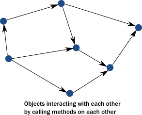
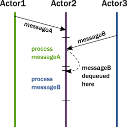
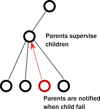
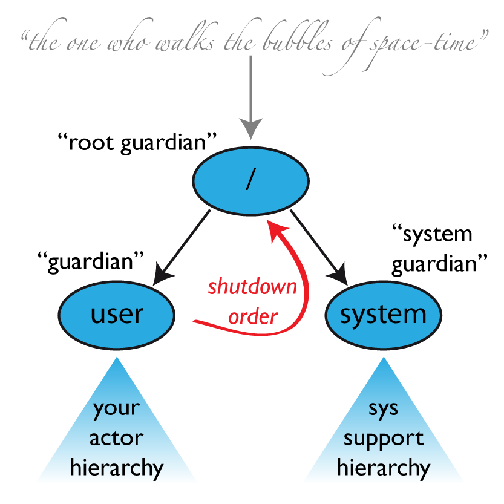

## 1. Actor模型

[为什么Actor模型是高并发事务的终极解决方案？](http://www.jdon.com/45728)

### 1.1 Akka

[分布式应用框架Akka快速入门](http://blog.csdn.net/jmppok/article/details/17264495)

[Actor模型探索](http://blog.csdn.net/jasonding1354/article/details/50555453)

[让并发和容错更容易](http://www.csdn.net/article/2014-12-17/2823174)

作为可计算实体，Actors有以下特性：

* 通讯方面，通过异常消息替代方法调用
* 各自管理自己的状态
* 处理消息，他们可以：
    * 创建别的(子Actors)Actors
    * 发送消息给别的Actors
    * 停止(子)Actors或使自己停止工作

#### 1.1.1 Actor模型解决了哪些问题？

[What problems does the actor model solve?](http://doc.akka.io/docs/akka/current/java/guide/actors-intro.html)
##### 1.1.1.1 封装的幻想

__单线程执行流程__

如下图，当多线程同时访问同一实例的某个方法，对象的封装模型不能保证该代码段按期望顺序执行。

__多线程执行流程__

公共的解决办法是，在这些方法执行时增加一把锁。这样可以保证在某个时刻，最多只有一个线程可以进入该方法，这是一种非常昂贵的策略：

* 锁严重的限制了并发
* 调用线程现在被阻塞，因此它不能做别的有意义的工作。有人可能会想到启动一个新的线程来处理该任务，但是线程同样是一种昂贵的抽象工具。
* 锁引入了一种新的威胁：死锁

这些实际情况导致了一种必然失败的场景：

* 不能获取适当的锁，状态将会被破坏(corrupted)
* 如果有很多锁，将损害性能并且容易导致死锁

在面向对象语言中，整个应用的状态流转如下：

在多线程分布式环境中，线程驱动程序执行：

总结：

* 只有在单线程访问时，能保证对对象封装。多线程中，几乎总会导致内部状态被破坏。
* 锁可以补救，在多线程环境中支持封装。但实践过程中，它是很低效且很容易导致死锁
* 锁只在本地环境中有效。尝试在分布式环境中使用，将会潜在的限制程序扩展

##### 1.1.1.2 现在计算机架构中共享内存的幻想

[CPU cache](https://en.wikipedia.org/wiki/CPU_cache)

在开发人员了解到这种情况时，如何找出哪些内存位置应该被标记成volatile，那种atomic结构应该被使用，也是一种暗黑艺术(dark art)。

* 现代CPU架构，不再有共享内存，像网络中的计算机一样。CPU核心之间明确的传递数据块(cache lines)。
* 除了对变量添加共享标记或使用Atomic数据结构。一种更纪律和规则的方式是将本地状态放入一个并发实体内，然后在并发实体间通过消息，传播数据或事件。

##### 1.1.1.3 调用栈幻想

__如上图，发生异常时主线程无法获知。__

总结：

* 为了在当前情况下实现并发并保证性能，线程必须通过一种高效的方式相互委托任务，而不是阻塞。针对这种任务委托并发，基于调用栈的异常处理机制将无法再正常工作，一个新的，明确的错误信息机制需要被引入。失败成为了领域模型的一部分了。
* 任务委托型的并发系统，需要处理服务故障，并有能力恢复它们。这些服务的客户端必意识到，在重启后，任务或消息可能丢失。虽然丢失不会发生，但由于之前的排队任务，可能会造成响应延迟。还一种延迟可能会由垃圾收集造成。面对这些问题，并发系统无法在规定时间处理响应，应该以超时作为一种处理手段。就像在网络或分布式系统中一样。

##### 1.1.1.4 Actor模型是如何满足分布式并发系统的需要的？

Actor模型的目标：

* 不依靠锁实行封装
* 使用合作实体模型来发送信令，改变状态，并通过彼此发送信令来驱动整个应用执行
* 停用与我们真实愿景不匹配的执行机制

__下面将描述，Actor是如何实现这些目标的：__
###### 1.1.1.4.1 通过应用消息传递，避免了锁和阻塞

消息传递与方法调用的第一个不同是，消息没有返回值。

我们需要在我们模型中第二个需要改变的是，恢复封装。

总结，当Actor接收到消息，将如何处理：

* Actor将消息添加到队列尾部
* 如果Actor不是调度执行的话，它将被标记成准备执行(ready to execute)
* 一个隐藏的scheduler实体将获取Actor，并开始执行它
* Actor从队列前面提取消息
* Actor修改内部状态，发送消息给别的Actor
* Actor变成非调度状态

为了达到以上的行为，Actor有：

* 信箱(存放消息的队列)
* 行为(Actor状态，内部变量等)
* 消息(数据块表示一种信令，与方法调用中的参数相似)
* 执行环境(一个装置，获取有消息需要处理的Actor，并调用它的消息处理代码)
* 一个地址

执行环境是一个精心编排的线程池，被用来驱动所有的这些动作透明的完成。

这儿有一个非常简单的模型，它解决了之前列出的问题：

* 通过解耦信令(signaling)和执行(execution)，从而保护了封装。(方法调用会传递execution，而消息传递不会)
* 这儿不需要锁。如果要修改Actor内部的状态，只能通过消息。这些消息是被一个一个的处理，从而消除了竞争
* 没有任何地方需要锁，发送者是不会被阻塞的。数百万个Actor可以通过十几个线程来高效的被调度，从而发挥现代CPU的全部潜在能力。任务委托是对Actor操作的固有模式。
* Actor的状态是本地的，不是共享的，变化和数据是通过消息进行传播的。这也映射出了，现代的内存层级是怎么工作的。在许多场景中，这意味着cache lines发生了转移，cache lines包含了消息中的数据，同时将本地状态和数据缓存在原始内核中。同样的模型可以精确的映射到远程通信，状态被保存在机器的RAM中，改变(changes)和数据(data)作为packet在网络上被传播。

###### 1.1.1.4.2 Actor可以优雅的处理错误状况

这儿有两种错误我们需要考虑：

* 由于任务中的错误，导致目标Actor上委托任务失败。典型是，验证错误，如不存在的用户ID。在这种情况，在保证目标Actor是完整的情况下来封装服务，这样的话，仅仅任务自己是错误的。服务Actor应该通过消息回复给消息发送者，出现了错误情况。这没有什么特殊的，错误是领域的一部分，因此错误是一种普通消息。
* 当服务碰到了一个内部错误。Akka强制要按照树型结构来组织所有的Actor，如一个Actor创建另一个Actor，该Actor将会是新Actor的父Actor。这是与操作系统组织进程到树结构相似。与进程类似，当Actor失败，它的父Actor将被通知，可以对失败做出处理。如果父Actor也停止工作，它的所有子Actor也递归停止工作。这个服务被称为管理者，它对Akka极为重要。

管理者(supervisor, parent)可以决定在特定错误类型下，重启子Actor，或在别的错误类型时，完全停止子Actor。子Actor不会默默的失去响应(如，进入无限循环，这种异常情况)，替代的是要不它们失败，要不它们的父Actor响应错误，或者它们被停止(在这种情况下，相关Actor将会自己被通知)。总是有一个责任实体来管理Actor：它的父Actor。对外部来说，重启不可见：在目标Actor重启时，协作Actor仍然继续发送消息。

#### 1.1.2 Akka类库及模块

[http://doc.akka.io/docs/akka/current/java/guide/modules.html](http://doc.akka.io/docs/akka/current/java/guide/modules.html)

##### 1.1.2.1 Actors(akka-actor library, the Core)

Actor的用途，跨越Akka库，提供了一个一致的，集成化的模型，使你可以摆脱单个的解决在并发和分布式系统设计过程中出现的一些挑战。同时它也一个用来处理并发和分布式低层模型，想要替代之前的那种对OOP的补救，希望把这些新特性带到OOP中。

Actor解决的挑战包括：

* 怎么样建造和设计高性能，并发应用
* 在多线程环境中如何处理错误
* 如何保护工程，不掉入并发陷井

##### 1.1.2.2 远程(Remoting)

Remoting使Actor可以是远程的，位于不同的计算机，无缝的交互消息。当被发布成jar，Remoting类似于一个模块，而不是一个类库。感觉Actor模型，远程消息与本地消息的发送看起是完全相同。

Remoting解决的挑战：

* 如何解决Actor系统可以位于远程主机
* 如何解决在远程Actor系统中的单个Actor
* 如何把消息转换成数据线上的字节
* 如何透明的管理低层的，在主机间的网络连接(重连)，检测崩溃的Actor系统和主机。
* 如何透明的，在同一个网络连接上，对一组不相关的Actor，进行多路通信

##### 1.1.2.3 集群(Cluster)

在大多数情况，你想使用集群来代替直接使用Remoting。

集群模块解决的挑战：

* 如何维护一个Actor系统集，彼此可以通信，并可以识别对方是集群的一部分
* 如何在一个已存在成员的系统集上，安全的引入一个新的系统
* 如何可靠的检测系统，如系统临时不可达
* 如何移出失败的主机或系统(缩减系统)，以便所有的剩余的成员同意保留一个集群子集
* 在当前成员集中，如何进行分布式计算
* 如何为集群中的某个成员指定角色，或者说，提供特定的服务而不是别的

##### 1.1.2.4 集群分片(Cluster Sharding)

分片的挑战：

* 如何在一个系统集上，建模或水平扩展一个大的有状态的实体集合
* 如何确保在集群中的实体，是恰当的分布，从而实现负载均衡
* 如何确保在从crashed系统迁移实体，但是状态不会丢失
* 如何确保在同一时间，多个不同系统中，某个实例不存在，因此要保证一致 性

##### 1.1.2.5 集群单例(Cluster Singleton)

在一个通用(非常通用)的分布式用户场景中，需要有一个单例实例负责处理在集群中其它成员间共享的或在宿主系统失败后迁移的task。然后这样不可避免会成为一个瓶颈，限制整个集群的扩展，在这样的场景中，不可避免要用到这个模式。

单例模块解决的挑战：

* 如何确保在集群中，某个服务只有一个实例运行
* 如何在宿主机carsh或由于服务降配引起的停机时，确保服务仍然运行
* 随时间流逝，假设该集群可以被迁移，如何使集群中的别的成员可以访问到该实例

##### 1.1.2.6 Cluster Publish-Subscribe

不同系统之间的协调过程中，经常要发布消息。这个模块，通常被称为发布-订阅(publish-subscrie)，这个模式解决这个需求问题。

集群发布订阅有意解决以下挑战：

* 如何给集群中某个感兴趣的集合广播消息
* 如何给集群中某个感兴趣集合的特定成员发送消息
* 在集群中，如何订阅和取消订阅特定topic中的事件

##### 1.1.2.7 持久化(Persistence)

像在OOP中的对象，Actor保持它的状态在volatile内存中。不管系统是正常退出还是出现异常，在内存中的所有数据将会丢失。持久化提供了一种模式，使Actor可以持久化那些会引起它状态变化的事件。在启动后，事件可以被回放，从而恢复Actor所持有实体的状态。事件流可以查询，并且注入辅助的处理管道(pipelines，如外部的大数据集群)或者一些别的展现形式(如，reports)。

持久化解决了以下挑战：

* 当系统重启或crash后，如何恢复实体或Actor的状态
* 如何实现[CQRS系统](https://msdn.microsoft.com/en-us/library/jj591573.aspx)(CQRS：Command Query Responsibility Segregation，命令查询职责分离)
* 如何确保在网络错误或系统crash时，消息的可靠传递
* 如何反省(introspect)一个会引起当前实体状态变化的领域事件(domain events)
* 在系统不段演变过程中，如何利用当前应用中[事件源](https://martinfowler.com/eaaDev/EventSourcing.html)(Event Sourcing)，来支持系统的长时间运行

##### 1.1.2.8 分布式数据(Distributed Data)

在一场景中，事件最终一致可以被接受，这样可以在Akka集群节点中共享数据，或在不同的集群片上同时来接收读和写操作。这可以使用[Conflict Free Replicated Data Types](https://en.wikipedia.org/wiki/Conflict-free_replicated_data_type)来实现，可以在不同的节点上并发的执行写操作，以可预测的方式在后期进行合并。分布式数据模块，提供了共享数据和可用数据类型的基础结构。

分布式数据有意解决以下挑战：

* 如何对等在不同集群片上接收写操作
* 如何同时确保低延迟本地读和写的情况下，共享数据

##### 1.1.2.9 流(Streams)

Actor是针对并发一个基础模型，但是这儿同时也有一些公共的模式，它要求用户反复实现相同的模式。非常通用的场景，例如，链；图；Actor；需要处理潜在的大的，无限的，有序事件源；恰当的协调资源的使用情况，防止链或图中的处理快的模块压夸处理慢的模块。Stream提供了一个对Actor的高度抽像，简化了写网络处理，在后台处理所有细节，提供了一个安全的，有类型的，组合的编程模型。Stream也是一个[Reactive Streams Standard](http://www.reactive-streams.org/)实现，可以与该标准的所有第三方实现库进行集成。

Stream解决了以下挑战：

* 如何利用并发和保持资源使用集中，高性能的处理大数据流和事件流。
* 如何将事件或数据处理中的可重用片断装配(assemble)进灵活的管道中
* 如何通过灵活的方式在成员连接异步服务，并且保证良好的性能
* 如何提供或与对接一个遵从Reactive Streams接口的第三方库

##### 1.1.2.10 HTTP

提供远程的，内部或外部API的事实标准是HTTP。Akka中的HTTP服务，是利用低层的Akka Streams来设计，尤其适用于处理大数据集或实时事件的流入和流出。

HTTP解决的挑战：

* 如何在保证性能的情况下，通过HTTP API暴露系统或集群中的服务给外部系统。
* 如何通过HTTP，实现大数据集在系统中流入和流出
* 如何通过HTTP，实现活动事件在系统中流入和流出

> NOTE
> 
> The above is an incomplete list of all the available modules, but it gives a nice overview of the landscape of modules and the level of sophistication you can reach when you start building systems on top of Akka. All these modules integrate with together seamlessly. For example, take a large set of stateful business objects (a document, a shopping cart, etc) that is accessed by on-line users of your website. Model these as sharded entities using Sharding and Persistence to keep them balanced across a cluster that you can scale out on-demand (for example during an advertising campaign before holidays) and keep them available even if some systems crash. Take the real-time stream of domain events of your business objects with Persistence Query and use Streams to pipe it into a streaming BigData engine. Take the output of that engine as a Stream, manipulate it using Akka Streams operators and expose it as web socket connections served by a load balanced set of HTTP servers hosted by your cluster to power your real-time business analytics tool.

#### 1.1.3 快速开始

##### 1.1.3.1 Akka Quickstart with Java

Actor是Akka中的执行单元。Actor模型是一个抽象，可以方便的写正确的并发，并行和分布式系统。

###### 1.1.3.1.1 示例下载

[CREATE A PROJECT FOR ME](http://dev.lightbend.com/start/?group=akka&project=akka-quickstart-java)

###### 1.1.3.1.2 Hello World实现了什么？

首先，主类创建了一个ActorSystem，它是一个Actor运行的容器。
接下来，它创建了三个Greeter Actor实例和一个Printer Actor实例
然后，发送消息给Greeter Actor实例，这些实例将在内部存储收到的消息。
最后，发送给Greeter Actor消息触发它们将消息发送给Printer Actor实例，Printer Actor消息被输出到Console

###### 1.1.3.1.3 使用Actor模型的好处

* 事件驱动模型
* 消息隔离原则
* 位置透明，系统使用工厂模式来构造Actor，返回的是实例的引用。由于位置是不重要的，Actor实例可以启动、停止、移动、为了扩展或降级而重启，同样可以从不期望的失败中恢复它们。
* 轻量级，每个实例只消耗数百个字节，因此实际中单台应用中可以存在数百万个并发Actor。

##### 1.1.3.2 定义Actor和消息

消息可以是任意类型的(Object的子类)。你可以发送被装箱的原始类型(String, Integer, Boolean)。消息同样可以是简单的数据结构，像数组或集合类型。

Hello World Actors使用了三种不同的消息：

* WhoToGreet：问候的接收者
* Greet：执行问候的指令
* Greeting：包含问候的消息

定义消息时，有以下建议：

* 由于消息是Actor的公共API，为消息起一个好的，有语义的和特定领域涵义的名字，尽管它只是封装了你的数据类型。
* 消息应该是不变的，因为它们是被不同的线程共享的
* 最好将与某个Actor消息关联的静态类放到Actor类中
* 通常情况下，在Actor中应该有一个静态的props方法，用来描述Actor如何被构建

###### 1.1.3.2.1 The Greeter Actor

    package com.lightbend.akka.sample;

    import akka.actor.AbstractActor;
    import akka.actor.ActorRef;
    import akka.actor.Props;
    import com.lightbend.akka.sample.Printer.Greeting;
    
    public class Greeter extends AbstractActor {
      static public Props props(String message, ActorRef printerActor) {
        return Props.create(Greeter.class, () -> new Greeter(message, printerActor));
      }
    
      static public class WhoToGreet {
        public final String who;
    
        public WhoToGreet(String who) {
            this.who = who;
        }
      }
    
      static public class Greet {
        public Greet() {
        }
      }
    
      private final String message;
      private final ActorRef printerActor;
      private String greeting = "";
    
      public Greeter(String message, ActorRef printerActor) {
        this.message = message;
        this.printerActor = printerActor;
      }
    
      @Override
      public Receive createReceive() {
        return receiveBuilder()
            .match(WhoToGreet.class, wtg -> {
              this.greeting = message + ", " + wtg.who;
            })
            .match(Greet.class, x -> {
              printerActor.tell(new Greeting(greeting), getSelf());
            })
            .build();
      }
    }

###### 1.1.3.2.2 The Printer Actor

    package com.lightbend.akka.sample;

    import akka.actor.AbstractActor;
    import akka.actor.ActorRef;
    import akka.actor.Props;
    import akka.event.Logging;
    import akka.event.LoggingAdapter;
    
    public class Printer extends AbstractActor {
      static public Props props() {
        return Props.create(Printer.class, () -> new Printer());
      }
    
      static public class Greeting {
        public final String message;
    
        public Greeting(String message) {
          this.message = message;
        }
      }
    
      private LoggingAdapter log = Logging.getLogger(getContext().getSystem(), this);
    
      public Printer() {
      }
    
      @Override
      public Receive createReceive() {
        return receiveBuilder()
            .match(Greeting.class, greeting -> {
                log.info(greeting.message);
            })
            .build();
      }
    }

##### 1.1.3.3 创建Actor

###### 1.1.3.3.1 位置透明的好处

在Akka中，你不能通过一个new关键字来创建实例。替代的，你创建需要使用factory来创建实例。factory不会返回Actor实例，而是返回一个akka.actor.ActorRef引用，它指向了一个Actor实例。在分布式系统中，这样的迂回可以增加很多灵活性和其它好处。

在Akka中位置不重要。位置透明意味着，ActorRef可以是一个运行在当前进程内或一个远程机器上。在必要情况下，运行时(监控者或管理者)可以在程序运行过程中通过改变Actor的位置或整个应用拓朴结构来优化系统。这使系统中失败管理里的"let it crash(让它崩溃)"模型可以通过crash失败Actor，同时启动一个新的Actor，来达到系统自愈。

###### 1.1.3.3.2 The Akka ActorSystem

akka.actor.ActorSystem工厂在某种程度上，与Spring的BeanFactory相类似。它扮演了一个Actor容器并管理着他们的生命周期。actorOf工厂方法在创建Actor时需要两个参数：一个是配置对象称为Props和一个名字。

Actor和ActorSystem的命名在Akka中是非常重要的。可以使用与你的领域模型相一致的有意义的名字，这样可以使它更容易，例如通过名字查找它。

创建Greeter和Printer Actor实例：

    final ActorRef printerActor = 
      system.actorOf(Printer.props(), "printerActor");
    final ActorRef howdyGreeter = 
      system.actorOf(Greeter.props("Howdy", printerActor), "howdyGreeter");
    final ActorRef helloGreeter = 
      system.actorOf(Greeter.props("Hello", printerActor), "helloGreeter");
    final ActorRef goodDayGreeter = 
      system.actorOf(Greeter.props("Good day", printerActor), "goodDayGreeter");

例子中我们只创建了一个Printer实例，所有的Actor共享这一个实例，但是实际上我们创建多个Printer Actor实例。例子中只使用了一个Printer实例，它指示了一个消息传递时一个很重要的概念，我们后面会提及。

##### 1.1.3.4 Aysnchronous Communication

Actor是被动的(reactive)和消息驱动的。在Actor收到消息前，不做任何事情。Actor通信使用异步消息。Actor的信箱本质上是一个支持顺序的消息队列。同一个Actor发送多条消息的顺序是会被保证的，但是可能与其它Actor的消息交叉。

当Actor不处理消息时，它处于挂起状态，除了内存，不会消耗任何的资源。再次显示了Actor的轻量、高效特性。

###### 1.1.3.4.1 给Actor发送消息

把消息放入Actor信息，使用ActorRef中的!(bang)方法。举例，Hello World的主类像下面介绍的那样给Greeter Actor发送消息：

    howdyGreeter.tell(new WhoToGreet("Akka"), ActorRef.noSender());
    howdyGreeter.tell(new Greet(), ActorRef.noSender());
    
    howdyGreeter.tell(new WhoToGreet("Lightbend"), ActorRef.noSender());
    howdyGreeter.tell(new Greet(), ActorRef.noSender());
    
    helloGreeter.tell(new WhoToGreet("Java"), ActorRef.noSender());
    helloGreeter.tell(new Greet(), ActorRef.noSender());
    
    goodDayGreeter.tell(new WhoToGreet("Play"), ActorRef.noSender());
    goodDayGreeter.tell(new Greet(), ActorRef.noSender());

Greeter Actor也发送消息给Printer Actor：

    printerActor.tell(new Greeting(greeting), getSelf());

##### 1.1.3.5 主类

Hello World的主类创建和控制Actor。ActorSystem作为一个容器被使用，并通过actorOf方法来创建Actor。最后，该类创建消息并发送给Actor。

    package com.lightbend.akka.sample;
    
    import akka.actor.ActorRef;
    import akka.actor.ActorSystem;
    import com.lightbend.akka.sample.Greeter.*;
    
    import java.io.IOException;
    
    public class AkkaQuickstart {
      public static void main(String[] args) {
        final ActorSystem system = ActorSystem.create("helloakka");
        try {
          final ActorRef printerActor = 
            system.actorOf(Printer.props(), "printerActor");
          final ActorRef howdyGreeter = 
            system.actorOf(Greeter.props("Howdy", printerActor), "howdyGreeter");
          final ActorRef helloGreeter = 
            system.actorOf(Greeter.props("Hello", printerActor), "helloGreeter");
          final ActorRef goodDayGreeter = 
            system.actorOf(Greeter.props("Good day", printerActor), "goodDayGreeter");
    
          howdyGreeter.tell(new WhoToGreet("Akka"), ActorRef.noSender());
          howdyGreeter.tell(new Greet(), ActorRef.noSender());
    
          howdyGreeter.tell(new WhoToGreet("Lightbend"), ActorRef.noSender());
          howdyGreeter.tell(new Greet(), ActorRef.noSender());
    
          helloGreeter.tell(new WhoToGreet("Java"), ActorRef.noSender());
          helloGreeter.tell(new Greet(), ActorRef.noSender());
    
          goodDayGreeter.tell(new WhoToGreet("Play"), ActorRef.noSender());
          goodDayGreeter.tell(new Greet(), ActorRef.noSender());
    
          System.out.println(">>> Press ENTER to exit <<<");
          System.in.read();
        } catch (IOException ioe) {
        } finally {
          system.terminate();
        }
      }
    }

##### 1.1.3.6 整个示例代码

[Full example code](http://developer.lightbend.com/guides/akka-quickstart-java/full-example.html)

##### 1.1.3.7 Actor测试

[Testing Actors](http://developer.lightbend.com/guides/akka-quickstart-java/testing-actors.html)

[TestKit](http://doc.akka.io/docs/akka/current/java/testing.html)

#### 1.1.4 Part 1: 顶级结构

以下章节，将主要介绍如何使用Akka来创建一个简化的物联网系统。简化的物联网为核心逻辑为，物联网设备安装在用户家中，可以通过传感器来报告温度数据；用户可以查询当前传感器的状态。为了简化，该系统不对外暴露接口，只关注在核心逻辑。

##### 1.1.4.1 物联网系统的目标

该应用有两个组件组成：

* 设备数据采集：负责为远程设备维护一个本地代表(或本地对象，Actor)。这些设备将会按家庭划分成不同的设备组。
* 用户dashboards：该组件负责周期性从用户的设备上收集数据，并将其展示成一个报表。

##### 1.1.4.2 顶级结构

Actor总是属于一个特定的父Actor。这意味着通常会用一个树形结构来描述Actor。一般来说，通常会在一个Actor内部创建另外一个Actor。这个Actor创建者会成为新的被创建的Actor的父。谁会是第一个被创建的Actor的父呢？创建顶级Actor，必须调用system.actorOf()。这不会创建一个独立的Actor，而是将相应的Actor注入到已存在的树中，作为一个子节点。

实际上，在系统中已存在三个Actor：

* /，被称为root守护者(root guardian)。这是系统中所有Actor的父，当系统停止时，它是最后一个停止工作的。
* /user，守护者。这是所有用户创建Actor的父Actor。它只是被用来标识一个用户空间。在这个地方的Actor不能访问Akka内部Actor(那些被Akka类库创建的Actor)。
* /system，系统守护者。

> NOTE
> 
> __Root守护者有父吗?__
> 
> 事实上它也有，这个特殊的实体被称为"Bubble-Walker"。这个特殊实体，对用户不可见，只是为了内部使用。

###### 1.1.4.2.1 ActorRef的结构和Actor路径

我们称以/user为父的Actor为顶级Actor。虽然实际情况它们不是顶级Actor，而只是在用户定义层级的顶层。

    package com.liuyf.demo.actor.akka.actor;

    import akka.actor.AbstractActor;
    import akka.actor.ActorRef;
    import akka.actor.ActorSystem;
    import akka.actor.Props;
    
    public class PrintMyActorRefActor extends AbstractActor {
    
        @Override
        public Receive createReceive() {
            return receiveBuilder()
                    .matchEquals("printit", p -> {
                        ActorRef secondRef = getContext().actorOf(Props.empty(), "second-actor");
                        System.out.println("Second: " + secondRef);
                    }).build();
        }
        
        public static void main(String[] args) {
            
            ActorSystem actorSystem = ActorSystem.create();
            ActorRef firstRef = actorSystem.actorOf(Props.create(PrintMyActorRefActor.class), "first-actor");
            
            System.out.println("First: " + firstRef);
            firstRef.tell("printit", ActorRef.noSender());
            
            // FIXME 如何成功退出并关闭Actor
        }
    
    }

输出结果为：

    First: Actor[akka://default/user/first-actor#-560908839]
    Second: Actor[akka://default/user/first-actor/second-actor#1261933912]

###### 1.1.4.2.2 Actor等级及其生命周期

[Lifecycle hooks](http://doc.akka.io/docs/akka/current/scala/actors.html#Actor_Lifecycle)

到目前为止，所有我们看到的Actor都被组织到一个严格的层级中。这个层级由三个预定义的上层Actor(root guardian, user guardian和system guardian)，以及用户创建的顶级Actor(直接位于/user下)及它们的子孙Actor组成。

两个问题：

* 为什么需要这个层级关系？
* 它有什么好处和用处？

> Note

> 解答：

> 第一个用途是用来管理Actor生命周期。当一个Actor关闭，它的所有子节点将递归的被关闭。通过这个层级，可以简化清除相关的资源，同时可以避免资源泄露。__事实上，在处理低层的多线程问题时，有一个难点容易被忽视，就是不同并发资源的生命周期。__

我们可以通过context.stop(actorRef)来停止一个Actor。通过使用该方法随意停用Actor，已经被大家所摒弃。__推荐的模式是通过在Actor内部调用context.stop(self)方法，使自己停止工作。通常作为一种对由Actor所定义的其它停止消息的一种响应处理机制，或者是Actor完成了它的工作。__

Actor API暴露了许多生命周期钩子函数(hooks)，以便Actor实现类可以重载它们。最通用的方法是：preStart和postStop。

* preStart()，在Actor开始后，且处理第一条消息前被调用。
* postStop()，在Actor停止前被调用。在这个时间点之后，将不会有消息再被处理。

示例代码：

__StartStopActor1.java__
    package com.liuyf.demo.actor.akka.actor;
    
    import akka.actor.AbstractActor;
    import akka.actor.ActorRef;
    import akka.actor.ActorSystem;
    import akka.actor.Props;
    
    public class StartStopActor1 extends AbstractActor {
        
        @Override
        public void preStart() throws Exception {
            
            System.out.println("first started");
            getContext().actorOf(Props.create(StartStopActor2.class), "second");
        }
    
        @Override
        public void postStop() throws Exception {
            
            System.out.println("first stopped");
        }
        
        @Override
        public Receive createReceive() {
            
            return receiveBuilder()
                    .matchEquals("stop", s -> {
                        getContext().stop(getSelf());
                    })
                    .build();
        }
    
        public static void main(String[] args) {
            
            ActorSystem actorSystem = ActorSystem.create();
            ActorRef first = actorSystem.actorOf(Props.create(StartStopActor1.class), "first");
            first.tell("stop", ActorRef.noSender());
        }
    
    }

__StartStopActor2.java__

    package com.liuyf.demo.actor.akka.actor;

    import akka.actor.AbstractActor;
    
    public class StartStopActor2 extends AbstractActor {
        
        @Override
        public void preStart() throws Exception {
            
            System.out.println("second started");
        }
    
        @Override
        public void postStop() throws Exception {
    
            System.out.println("second stopped");
        }
        
        @Override
        public Receive createReceive() {
            return receiveBuilder()
                    .build();
        }

    }

__输出结果：__

    first started
    second started
    second stopped
    first stopped

###### 1.1.4.2.3 层级与异常处理(监控)

[Supervision reference page](http://doc.akka.io/docs/akka/current/general/supervision.html)

父子Actor不仅通过生命周期连接。当Actor失败时(通过receive抛出异常或未处理的异常)，它被临时挂起。这个失败信息将会被传播到它的父Actor，它来决定怎么处理由子Actor引发的异常。默认的管理策略是，停止并重启子Actor。如果你不改变默认策略，所有的失败都会造成重启。

__SupervisedActor.java__

    package com.liuyf.demo.actor.akka.tutorials.supervision;
    
    import akka.actor.AbstractActor;
    
    public class SupervisedActor extends AbstractActor {
        
        @Override
        public void preStart() throws Exception {
    
            System.out.println("supervised actor started");
        }
    
        @Override
        public void postStop() throws Exception {
            
            System.out.println("supervised actor stopped");
        }
        
        @Override
        public Receive createReceive() {
            
            return receiveBuilder()
                    .matchEquals("fail", f -> {
                        
                        System.out.println("supervised actor fails now");
                        throw new Exception("I failed!");
                    })
                    .build();
        }
    
    }

__SupervisingActor.java__

    package com.liuyf.demo.actor.akka.tutorials.supervision;
    
    import akka.actor.AbstractActor;
    import akka.actor.ActorRef;
    import akka.actor.ActorSystem;
    import akka.actor.Props;
    
    public class SupervisingActor extends AbstractActor {
    
        ActorRef child = getContext().actorOf(Props.create(SupervisedActor.class), "supervised-actor");
        
        @Override
        public Receive createReceive() {
            
            return receiveBuilder()
                    .matchEquals("failChild", f -> {
                        child.tell("fail", getSelf());
                    })
                    .build();
        }
        
        public static void main(String[] args) throws InterruptedException {
            
            ActorSystem system = ActorSystem.create();
            
            ActorRef supervisingActor = system.actorOf(Props.create(SupervisingActor.class), "supervising-actor");
            supervisingActor.tell("failChild", ActorRef.noSender());
            
            Thread.sleep(20000);
            
            supervisingActor.tell("failChild", ActorRef.noSender());
        }
    
    }

运行以上程序，你将会发现，两次异常被抛出后。SupersivedActor都会重启。

###### 1.1.4.2.4 The First Actor

面临的问题是，如何把顶级组件映射成Actor。

我们可能会被迷惑，把一些主要组件创建成Actor，并把它们放在顶级Actor的位置。然而，我们推荐创建一个明确的组件来表示整个应用。换句话说就是在我们的系统中，将只有一个顶级的Actor，别的主要组件作为该Actor的子Actor。

创建Actor，通过使用Actor推荐的创建模式，在Actor中定义一个Props静态方法。

__IotSupervisor.java__

    package com.liuyf.demo.actor.akka.tutorials.iot;
    
    import akka.actor.AbstractActor;
    import akka.actor.Props;
    import akka.event.Logging;
    import akka.event.LoggingAdapter;
    
    public class IotSupervisor extends AbstractActor {
    
        private final LoggingAdapter log = Logging.getLogger(getContext().getSystem(), this);
        
        public static Props props() {
            return Props.create(IotSupervisor.class);
        }
        
        @Override
        public void preStart() {
            log.info("IoT Application started");
        }
        
        @Override
        public void postStop() {
            log.info("IoT Application stopped");
        }
        
        @Override
        public Receive createReceive() {
            
            return receiveBuilder().build();
        }
    
    }

__IotMain.java__

    package com.liuyf.demo.actor.akka.tutorials.iot;
    
    import java.io.IOException;
    
    import akka.actor.ActorRef;
    import akka.actor.ActorSystem;
    
    public class IotMain {
    
        public static void main(String[] args) throws IOException {
            
            ActorSystem system = ActorSystem.create("iot-system");
            
            try {
                
                ActorRef supervisor = system.actorOf(IotSupervisor.props(), "iot-supervisor");
            
                System.out.println("Press ENTER to exit the system");
                System.in.read();
            } finally {
                system.terminate();
            }
        }
    }

#### 1.1.5 Part 2: 设备Actor

接下来我们将实现一个表示设备的Actor，这个Actor完成的任务:

* 收集测定的温度数据
* 有请求时，报告最后测定的温度

在Actor世界中，与接口相类似的是协议。当然，在程序语言中是不可能实现通用的协议，但我们可以把它抽象成最基本的元素：消息。

##### 1.1.5.1 查询协议(query protocol)

从设备Actor获取当前温度的协议，比较简单：

* 等待接收查看当前服务的请求
* 通过回复当前温度或一个表示当前不可用的指示，来响应接收的请求

我们需要两个消息，一个是为了请求，一个为了回复。

    public static final class ReadTemperature {
    }
    
    public static final class RespondTemperature {
        final Optional<Double> value;
    
        public RespondTemperature(Optional<Double> value) {
            this.value = value;
        }
    }

##### 1.1.5.2 消息顺序，投递保证

__在写Actor时，要保证即使消息丢失也是安全的，可接受的，保守处理(pessimistic bet)。__

在Akka中消息发送的规则：

* 最多一次递送，如，不保证递送
* 消息的顺序是由每个发送者和接收者维护的

###### 1.1.5.2.1 什么是最多一次递送

这涉及到一个递送机制，有三种类型：

* 最多一次递送：每条消息被处理的机制。消息被递送零次或1次；换句话说就是，消息可能会被丢失，但决不会重复。
* 最少一次递送：消息在递送时，会进行多次尝试，这样至少会有一个成功；换句话说就是，消息可能会重复，但决不会丢失。
* 只有一次递送：消息明确的只会投递一次。这也意味着，消息既不会丢失，也不会重复。

> Note
> 
> 总结：
> 
> * 第一个代价最小，性能最高，最小的实现资源开销。因为它可以采用fire-and-forget(发射后不理)来处理，不需要维护消息发送后的状态或消息传输中的状态
> * 第二个要求重试，来应对传输丢失的情况。那意味着要维护消息发送后的状态，在消息接收后要有一个应答机制。
> * 最昂贵的是第三个，因此性能最差。除了第二个要求的，它还要求在消息被接收后还要维护消息的状态，为了过滤重复投递。

###### 1.1.5.2.2 为什么不保证投递

这个问题的核心是有哪些要被保证，例如，在投递中的那个点应该被保证：

* 消息被发送到网络上时？
* 消息被别的主机接收到时？
* 消息是被放入目标Actor的信箱时？
* 消息是开始被目标Actor处理时？
* 消息被目标Actor成功处理时？

大多数框架或协议声称保证消息递送，实现了提供了与第4点和第5点相类似的功能。这听起来很美好，是否这样真的有用？要理解这被后隐含的问题，可以通过一个简单的实际例子来说明，一个用户尝试下一个订单，我们要求它被成功处理，并且要在数据库中包含有订单。

如果我们依赖系统在订单被提交到内部API，这些API负责验证，处理，并放它到数据库后，才返回成功。不幸的是，在API被调用后，却立即发生了以下情况：

* 主机carsh
* 反序列化失败
* 验证失败
* 数据库不可用
* 程序发生错误

这个问题就变成了，消息保证机制不是领域级的保证机制。

__只有应用程序可以报告成功，因为只有它理解领域保证的要求。没有通用的框架可以识别特定的领域细节，以及在领域中什么是被认为成功。__在这个例子中，我们只想在数据库成功被写入，数据库确认订单被安全的保存后，才返回成功信号。__出于这些原因，Akka将这个保证责任提交了应用自己。例如，应用程序不得不自己实现它们。换句话就是，你完全提供你需要保证机制所控制的内容。__

###### 1.1.5.2.3 消息顺序

对于特定于一对Actor的规则是，从第一个Actor发送的消息，第二个不能无序(out-of-order))接收。这个词(译者注：是指out-of-order)强调的是，只保证通过tell操作直接发送到最终目标，而不是使用中间媒介。

如果：

* Actor A1发送消息M1, M2, M3 to A2
* Actor A3发送消息M4, M5, M6 to A2

这意味着：

* 如果M1被递送，它必须在M2和M3之前
* 如果M2被递送，它必须在M3之前
* 如果M4被递送，它必须在M5和M6之前
* 如果M5被递送，它必须在M6之前。
* A2可以看见A1和A3的消息交叉出现
* 由于不保证递送，任何消息都可能被丢掉。例如，不能到达A2

关于递送保证的细节，可以参考[reference page](http://doc.akka.io/docs/akka/current/general/message-delivery-reliability.html)。

###### 1.1.5.2.3 重提查询协议(query protocol)

我们最初的查询协议没有问题，但是它限制了我们的灵活性。如果我们想要在Actor中实现重发，来查询我们的设备Actor(因为超时请求的原因)或想要查询多个Actor，放一个附加的查询ID在消息中，对我们来说是非常有帮助的，我们可以在请求与响应之间建立关联关系。

__代码做以下调整：__

    public static final class ReadTemperature {
        final long requestId;
    
        public ReadTemperature(long requestId) {
            this.requestId = requestId;
        }
    }
    
    public static final class RespondTemperature {
        final long requestId;
        final Optional<Double> value;
    
        public RespondTemperature(long requestId, Optional<Double> value) {
            this.requestId = requestId;
            this.value = value;
        }
    }

__DeviceActor.java__

    package com.liuyf.demo.actor.akka.tutorials.iot.device;

    import java.util.Optional;
    
    import akka.actor.AbstractActor;
    import akka.actor.Props;
    import akka.event.Logging;
    import akka.event.LoggingAdapter;
    
    public class DeviceActor extends AbstractActor {
    
        private final LoggingAdapter log = Logging.getLogger(getContext().getSystem(), this);
        
        final String groupId;
        
        final String deviceId;
        
        public DeviceActor(String groupId, String deviceId) {
            
            this.groupId = groupId;
            this.deviceId = deviceId;
        }
        
        public static Props props(String groupId, String deviceId) {
            return Props.create(DeviceActor.class, groupId, deviceId);
        }
        
        public static final class ReadTemperature {
            
            final long requestId;
            
            public ReadTemperature(long requestId) {
                
                this.requestId = requestId;
            }
        }
        
        public static final class RespondTemperature {
            
            final long requestId;
            
            final Optional<Double> value;
            
            public RespondTemperature(long requestId, Optional<Double> value) {
                
                this.requestId = requestId;
                this.value = value;
            }
        }
        
        Optional<Double> lastTemperatureReading = Optional.empty();
        
        @Override
        public void preStart() {
            log.info("Device actor {} - {} started", groupId, deviceId);
        }
        
        @Override
        public void postStop() {
            log.info("Device actor {} - {} stopped", groupId, deviceId);
        }
        
        @Override
        public Receive createReceive() {
            return receiveBuilder()
                    .match(ReadTemperature.class, r -> {
                        
                        getSender().tell(new RespondTemperature(r.requestId, lastTemperatureReading), getSelf());
                    }).build();
        }
    
    }

__DeviceActorTest.java__
    package com.liuyf.demo.actor.akka.tutorials.iot.device;
    
    import static org.junit.Assert.assertEquals;
    
    import java.util.Optional;
    
    import org.junit.Test;
    
    import akka.actor.ActorRef;
    import akka.actor.ActorSystem;
    import akka.testkit.javadsl.TestKit;
    
    public class DeviceActorTest {
    
        @Test
        public void test() {
            
            ActorSystem system = ActorSystem.create();
            
            TestKit probe = new TestKit(system);
            
            ActorRef deviceActor = system.actorOf(DeviceActor.props("group", "device"));
            deviceActor.tell(new DeviceActor.ReadTemperature(42L), probe.getRef());
            
            DeviceActor.RespondTemperature respondTemperature = probe.expectMsgClass(DeviceActor.RespondTemperature.class);
            
            
            assertEquals(42L, respondTemperature.requestId);
            assertEquals(Optional.empty(), respondTemperature.value);
        }
    
    }

###### 1.1.5.2 查协议

在接收到温度记录请求时，更新currentTemperature属性。

包含温度信息的消息：

    public static final class RecordTemperature {
    
        final double value;
    
        public RecordTemperature(double value) {
            this.value = value;
        }
    }

由于Akka不保证消息的传递。因此在我们示例中，在更新最后的温度记录后，给服务器发送一个应答消息。如，TemperatureRecoreded。像上面查询协议一样，包含一个ID属性是一个好的方式，可以提供最大限度的灵活性。

整合读写消息到DeviceActor：

    package com.liuyf.demo.actor.akka.tutorials.iot.device;
    
    import java.util.Optional;
    
    import akka.actor.AbstractActor;
    import akka.actor.Props;
    import akka.event.Logging;
    import akka.event.LoggingAdapter;
    
    public class DeviceActor extends AbstractActor {
    
        private final LoggingAdapter log = Logging.getLogger(getContext().getSystem(), this);
        
        final String groupId;
        
        final String deviceId;
        
        public DeviceActor(String groupId, String deviceId) {
            
            this.groupId = groupId;
            this.deviceId = deviceId;
        }
        
        public static Props props(String groupId, String deviceId) {
            return Props.create(DeviceActor.class, groupId, deviceId);
        }
        
        public static final class RecordTemperature {
            
            final long requestId;
            final double value;
            
            public RecordTemperature(long requestId, double value) {
                
                this.requestId = requestId;
                this.value = value;
            }
        }
        
        public static final class TemperatureRecorded {
            
            final long requestId;
            
            public TemperatureRecorded(long requestId) {
                
                this.requestId = requestId;
            }
        }
        
        public static final class ReadTemperature {
            
            final long requestId;
            
            public ReadTemperature(long requestId) {
                
                this.requestId = requestId;
            }
        }
        
        public static final class RespondTemperature {
            
            final long requestId;
            
            final Optional<Double> value;
            
            public RespondTemperature(long requestId, Optional<Double> value) {
                
                this.requestId = requestId;
                this.value = value;
            }
        }
        
        Optional<Double> lastTemperatureReading = Optional.empty();
        
        @Override
        public void preStart() {
            log.info("Device actor {} - {} started", groupId, deviceId);
        }
        
        @Override
        public void postStop() {
            log.info("Device actor {} - {} stopped", groupId, deviceId);
        }
        
        @Override
        public Receive createReceive() {
            return receiveBuilder()
                    .match(RecordTemperature.class, r -> {
                        
                        log.info("Recorded temperature reading {} with {}", r.value, r.requestId);
                        lastTemperatureReading = Optional.of(r.value);
                        getSender().tell(new TemperatureRecorded(r.requestId), getSelf());
                    })
                    .match(ReadTemperature.class, r -> {
                        
                        getSender().tell(new RespondTemperature(r.requestId, lastTemperatureReading), getSelf());
                    }).build();
        }
    
    }

我们也有责任写一个测试类，来测试read/query和write/record功能。

    @Test
    public void testReplyWithLatestTemperatureReading() {
        
        ActorSystem system = ActorSystem.create();
        
        TestKit probe = new TestKit(system);
        
        ActorRef deviceActor = system.actorOf(DeviceActor.props("group", "device"));
        
        deviceActor.tell(new DeviceActor.RecordTemperature(1L, 24.0), probe.getRef());
        assertEquals(1L, probe.expectMsgClass(DeviceActor.TemperatureRecorded.class).requestId);
        
        deviceActor.tell(new DeviceActor.ReadTemperature(2L), probe.getRef());
        DeviceActor.RespondTemperature respond1 = probe.expectMsgClass(DeviceActor.RespondTemperature.class);
        assertEquals(2L, respond1.requestId);
        assertEquals(Optional.of(24.0), respond1.value);
        
        deviceActor.tell(new DeviceActor.RecordTemperature(3L, 55.0), probe.getRef());
        assertEquals(3L, probe.expectMsgClass(DeviceActor.TemperatureRecorded.class).requestId);
        
        deviceActor.tell(new DeviceActor.ReadTemperature(4L), probe.getRef());
        DeviceActor.RespondTemperature respond2 = probe.expectMsgClass(DeviceActor.RespondTemperature.class);
        assertEquals(4L, respond2.requestId);
        assertEquals(Optional.of(55.0), respond2.value);
    }

#### 1.1.6 Part 3: 设备组和管理

[本节源码](https://github.com/akka/akka/tree/master/akka-docs/src/test/java/jdocs/tutorial_3)

在本章节中，我们把设备Actor集成到一个管理设备的组件中。当有新的设备上线时，这儿没有对应的Actor表示它。我们要有能力在必要的时候，利用设备管理组件来在请求的组下创建一个设备Actor(或返回一个已存在的Actor引用)。

在真实系统中，连接设备的步骤可能如下：

1. 设备通过一些协议连接到我们的系统
2. 管理网络连接的组件接受连接
3. 获取设备Id和所属的组Id
4. 基于给定的Ids，设备管理组件需要创建组和设备Actor(或返回已存在的Actor)。
5. 设备Actor(被查询或定位时)响应一应答，同时直接暴露它的ActorRef(通过应答的发送者)。
6. 网络组件直接使用设备的ActorRef，避免检查组件。

现在我们只涉及第4部和第5部。我们将设备管理组件建模成一个三级的Actor树：

* 顶级是supervisor actor代表的组件。它也是查找或创建组和设备Actor的入口。
* 设备组Actor是属于某个组的设备的supersvisor。除了监控设备actor外，它也提供一些扩展服务，如在查询从所有可能设备上获得的温度信息。
* 设备Actor管理所有和实际设备的交互，例如，存储获得的温度信息。

设计Actor系统的主要挑战是如何决定Actor的粒度。我们选择这个三层结构，基于以下原因：

* 把组划分成独立的Actor
    * 允许我们隔离组中发生的错误
    * 简化查询属于某个组的所有设备这个问题(因此它只包含与给定组相关的状态)
    * 增加了系统的并发，允许同时查询多个组

* 把设备划分成独立的Actor
    * 允许我们从其它设备中隔离出出错的设备Actor
    * 增加了收集温度信息的并发性，因为不同设备的网络连接可以直接与特定的设备Actor交互，减少了竞争问题

实践过程中，以下指南可以帮助达到正确粒度的划分：

* 从大粒度到小粒度。引入更细粒度的Actor，比它实际需要的，可能会引起多于它所解决的问题。
* 如果引入它可以带给系统更高的并发，则选择更细的粒度。
* 如果Actor需要处理与其它Actor间很复杂的会话，因此会有很多状态，则选择更细的粒度。下一节，我们将看到一个很好的例子。
* 如果和划分成更小的Actor相比，围绕某个组件有太多的状态，则选择更细的粒度
* 如果当前Actor有许多不相关的职责，这些可能单独失败并被恢复，则选择更细的粒度。

##### 1.1.6.1 注册协议

这个协议将由DeviceManager组件自己提供，因为只有它自己能预先知道：设备组和设备是按需创建的。注册设备的步骤如下：

1. 设备管理器接收到请求，要求跟踪特定组中的设备
2. 如果设备管理器已经有一个对应的设备组Actor，它把请求转发给这个Actor。否则，它首先创建一个，然后将请求转发给它。
3. 设备组接收请求，要求为特定设备创建对应的Actor。
4. 如果该组中，已经有对应设备的Actor，它转发请求给它。否则，它首先创建一个，然后将请求转发给它。
5. 设备Actor接收请求，并返回应答给它最初的发送者。由于设备Actor是应答的发送者，接收者(如设备)，是有能力识别它的ActorRef，在未来直接发送消息给它的设备Actor。

定义请求和它们应答通讯的消息：

    public static final class RequestTrackDevice {
        
        public final String groupId;
        
        public final String deviceId;
        
        public RequestTrackDevice(String groupId, String deviceId) {
            
            this.groupId = groupId;
            this.deviceId = deviceId;
        }
    }
    
    public static final class DeviceRegistered {
        
    }

##### 1.1.6.2 为设备Actor添加注册支持

注册流程很简单，给注册请求者回复一个应答。***我们假设注册消息的发送者是被隐藏在上一层。在下节我们将会揭示，这是如何实现的。***

同时我们做了处理，防止不匹配的组或设备Id进来。

修改DeviceActor的createReceive方法：

    @Override
    public Receive createReceive() {
        return receiveBuilder()
                .match(RequestTrackDevice.class, r -> {
                    
                    if (this.groupId.equals(r.groupId)
                            && this.deviceId.equals(r.deviceId)) {
                        
                        getSender().tell(new DeviceRegistered(), getSelf());
                    } else {
                        log.warning("Ignoring TrackDevice request for {}-{}. This actor is responsible for {}-{}.",
                                r.groupId,
                                r.deviceId,
                                this.groupId,
                                this.deviceId
                        );
                    }
                })
                .match(RecordTemperature.class, r -> {
                    
                    log.info("Recorded temperature reading {} with {}", r.value, r.requestId);
                    lastTemperatureReading = Optional.of(r.value);
                    getSender().tell(new TemperatureRecorded(r.requestId), getSelf());
                })
                .match(ReadTemperature.class, r -> {
                    
                    getSender().tell(new RespondTemperature(r.requestId, lastTemperatureReading), getSelf());
                }).build();
    }

单元测试：

    @Test
    public void testReplyToRegistrationRequests() {
        
        ActorSystem system = ActorSystem.create();
        
        TestKit probe = new TestKit(system);
        
        ActorRef deviceActor = system.actorOf(DeviceActor.props("group", "device"));
        
        deviceActor.tell(new DeviceManagerActor.RequestTrackDevice("group", "device"), probe.getRef());
        probe.expectMsgClass(DeviceManagerActor.DeviceRegistered.class);
        assertEquals(deviceActor, probe.getLastSender());
    }
    
    @Test
    public void testIgnoreWrongRegistrationRequests() {
        
        ActorSystem system = ActorSystem.create();
        
        TestKit probe = new TestKit(system);
        
        ActorRef deviceActor = system.actorOf(DeviceActor.props("group", "device"));
        
        deviceActor.tell(new DeviceManagerActor.RequestTrackDevice("wrongGroup", "device"), probe.getRef());
        probe.expectNoMsg();
        
        deviceActor.tell(new DeviceManagerActor.RequestTrackDevice("group", "wrongDevice"), probe.getRef());
        probe.expectNoMsg();
    }

##### 1.1.6.3 设备组

为了能够通过它的设备Id查找到子Actor，我们使用一个Map<String, ActorRef>来管理子Actor。

我们也要保留请求的发送者，以便我们的设备Actor可以直接回复。我们要使用forward代替tell操作。两者不同之处是，forward会保留原始发送者，而tell总是把发送者设置成当前actor。同时，像设备一样，我们只响应正确匹配的groupId：

    package com.liuyf.demo.actor.akka.tutorials.iot.device;

    import java.util.HashMap;
    import java.util.Map;
    import java.util.Set;
    
    import akka.actor.AbstractActor;
    import akka.actor.ActorRef;
    import akka.actor.Props;
    import akka.actor.Terminated;
    import akka.event.Logging;
    import akka.event.LoggingAdapter;
    
    public class DeviceGroupActor extends AbstractActor {
    
        private final LoggingAdapter log = Logging.getLogger(getContext().getSystem(), this);
        
        final String groupId;
        
        public DeviceGroupActor(String groupId) {
            
            this.groupId = groupId;
        }
        
        public static Props props(String groupId) {
            
            return Props.create(DeviceGroupActor.class, groupId);
        }
        
        public static final class RequestDeviceList {
            final long requestId;
    
            public RequestDeviceList(long requestId) {
                this.requestId = requestId;
            }
        }
        
        public static final class ReplyDeviceList {
            final long requestId;
            final Set<String> ids;
    
            public ReplyDeviceList(long requestId, Set<String> ids) {
                this.requestId = requestId;
                this.ids = ids;
            }
        }
        
        final Map<String, ActorRef> deviceIdToActor = new HashMap<>();
        final Map<ActorRef, String> actorToDeviceId = new HashMap<>();
        
        @Override
        public void preStart() {
            
            log.info("DeviceGroup {} started", groupId);
        }
        
        @Override
        public void postStop() {
            
            log.info("DeviceGroup {} stopped", groupId);
        }
        
        private void onTrackDevice(DeviceManagerActor.RequestTrackDevice trackDevice) {
            
            if (this.groupId.equals(trackDevice.groupId)) {
                
                ActorRef deviceActor = deviceIdToActor.get(trackDevice.deviceId);
                if(deviceActor != null) {
                    
                    deviceActor.forward(trackDevice, getContext());
                } else {
                    
                    log.info("Creating device actor for {}", trackDevice.deviceId);
                    deviceActor = getContext().actorOf(DeviceActor.props(groupId, trackDevice.deviceId));
                    actorToDeviceId.put(deviceActor, trackDevice.deviceId);
                    deviceIdToActor.put(trackDevice.deviceId, deviceActor);
                    deviceActor.forward(trackDevice, getContext());
                }
            } else {
                
                log.warning("Ignoring TrackDevice request for {}. This actor is responsible for {}",
                        trackDevice.groupId,
                        this.groupId);
                
            }
        }
        
        private void onDeviceList(RequestDeviceList r) {
            
            getSender().tell(new ReplyDeviceList(r.requestId,  deviceIdToActor.keySet()), getSelf());
        }
        
        private void onTerminated(Terminated t) {
            
            ActorRef deviceActor = t.getActor();
            String deviceId = actorToDeviceId.get(deviceActor);
            log.info("Device Actor for {} has been terminated", deviceId);
            actorToDeviceId.remove(deviceActor);
            deviceIdToActor.remove(deviceId);
        }
        
        @Override
        public Receive createReceive() {
            
            return receiveBuilder()
                    .match(DeviceManagerActor.RequestTrackDevice.class, this :: onTrackDevice)
                    .match(RequestDeviceList.class, this :: onDeviceList)
                    .match(Terminated.class, this :: onTerminated)
                    .build();
        }
    
    }

遗留工作：

* 从我们的测试代码停止设备Actor。想从外部停止任何一个Actor，都可以给Actor发送一个特殊的内置消息，PoisonPill，指示Actor停止。
* 一旦设备Actor被停止，需要被通知：我们可以使用Death Watch工具来实现。感谢TestKit给我们提供这两个工具，watch()，监视某个特定的actor；expectTerminated维护被监视的Actor是否终止工作。

##### 1.1.6.4 设备管理

    package com.liuyf.demo.actor.akka.tutorials.iot.device;

    import java.util.HashMap;
    import java.util.Map;
    
    import akka.actor.AbstractActor;
    import akka.actor.ActorRef;
    import akka.actor.Props;
    import akka.actor.Terminated;
    import akka.event.Logging;
    import akka.event.LoggingAdapter;
    
    public class DeviceManagerActor extends AbstractActor {
    
        private final LoggingAdapter log = Logging.getLogger(getContext().getSystem(), this);
        
        public static Props props() {
            
            return Props.create(DeviceManagerActor.class);
        }
        
        public static final class RequestTrackDevice {
            
            public final String groupId;
            
            public final String deviceId;
            
            public RequestTrackDevice(String groupId, String deviceId) {
                
                this.groupId = groupId;
                this.deviceId = deviceId;
            }
        }
        
        public static final class DeviceRegistered {
            
        }
        
        final Map<String, ActorRef> groupIdToActor = new HashMap<>();
        final Map<ActorRef, String> actorToGroupId = new HashMap<>();
        
        @Override
        public void preStart() {
            log.info("DeviceManager started");
        }
        
        @Override
        public void postStop() {
            log.info("DeviceManager stopped");
        }
        
        private void onTrackDevice(RequestTrackDevice trackDevice) {
            
            String groupId = trackDevice.groupId;
            ActorRef ref = groupIdToActor.get(groupId);
            if (ref != null) {
                ref.forward(trackDevice, getContext());
            } else {
                
                log.info("Creating device group actor for {}", groupId);
                ActorRef groupActor = getContext().actorOf(DeviceGroupActor.props(groupId), "group-" + groupId);
                getContext().watch(groupActor);
                groupActor.forward(trackDevice, getContext());
                groupIdToActor.put(groupId, groupActor);
                actorToGroupId.put(groupActor, groupId);
            }
        }
        
        private void onTerminated(Terminated t) {
            
            ActorRef groupActor = t.getActor();
            String groupId = actorToGroupId.get(groupActor);
            log.info("Device group actor for {} has been terminated", groupId);
            actorToGroupId.remove(groupActor);
            groupIdToActor.remove(groupId);
        }
        
        @Override
        public Receive createReceive() {
            
            return receiveBuilder()
                    .match(RequestTrackDevice.class, this :: onTrackDevice)
                    .match(Terminated.class, this :: onTerminated)
                    .build();
        }
    
    }

#### 1.1.7 Part 4: 查询设备组

设备的状态：

* 有温度信息，Temperature
* 有响应，但是没有温度信息，TemperatureNotAvailable
* 在回答前，停止工作，DeviceNotAvailable
* 在deadline前，没有响应，DeviceTimeOut

总结一下这些消息类型，我们可以在DeviceGroup中加入以下代码：

    public static final class RequestAllTemperatures {
        
        final long requestId;
        
        public RequestAllTemperatures(long requestId) {
            this.requestId = requestId;
        }
    }
    
    public static final class RespondAllTemperatures {
        
        final long requestId;
        final Map<String, TemperatureReading> temperatures;
        
        public RespondAllTemperatures(long requestId, Map<String, TemperatureReading> temperatures) {
            this.requestId = requestId;
            this.temperatures = temperatures;
        }
    }
    
    public static interface TemperatureReading {
        
    }
    
    public static final class Temperature implements TemperatureReading {
        
        public final double value;
        
        public Temperature(double value) {
            this.value = value;
        }
    }
    
    public static final class TemperatureNotAvailable implements TemperatureReading {
        
    }
    
    public static final class DeviceNotAvailable implements TemperatureReading {
        
    }
    
    public static final class DeviceTimeOut implements TemperatureReading {
        
    }

##### 1.1.7.1 实现Query

我们将创建一个Actor，用来表示单个查询，并执行组Actor中为了完成查询所需要完成的一些Task。到目前为止，我们创建的Actor都属于典型的域对象，但是现在我们将创建表示进程或任务的Actor。这一小的变化，使我们的设备组Actor保持简单，并且使我们可以更好的隔离对query进行测试。

首先们需要设计我们的查询Actor的生命周期。这由几部分组成，设别初始状态，Actor执行的第一个动作，必要情况下的清理工作。

在以下情况中，查询应该工作：

* 通过它们的IDs，查询活动设备Actor的快照。
* 发起查询请求的requestID(因此，我们可以把它包含在回复中)
* 发送给组Actor查询的Actor的ActorRef。我们将直接回复给这个Actor。
* 超时参数，查询应该在回复到达前等待多长时间。使超时时间作为参数，有利于简化测试。

现在该引入之前没有使过的一个特性了，Timers。Akka有一个内置的调度工具。应用它很简单，scheduler.scheduleOnce(time, actorRef, message, executor, sender)方法将在由time指定的某个时刻，调度一个消息message，然后把它发送给actorRef指定的Actor。为了实现我们查询超时，我们需要创建一个表示超时时间的消息。我们创建一个没有任何参数的简单消息，CollectionTimeout。scheduleOne的返回值是一个Cancellable，如果查询准时的成功完成，该返回值可以被用来取消timer。可以通过ActorSystem，获取想要获得的scheduler。另外，也可以通过Actor上下文来访问scheduler，getContext().getSystem().scheduler()。这需要一个ExecutionContext，这个上下文基本上就是一个线程池，它将自己执行这些timer task。在我们这个场景中，通过传入getContext().dispatcher()，我们使用相同的dispatcher作为actor。

在查询开始时，我们要求每个设备Actor报告当前的温度。为了有能力快速的检查，在得到ReadTemperature消息前停止的设备，我们也将监视每个Actor。通过这种方式，在查询的生命周期内，我们为了获取那些停止的Actor的Terminated消息，因此我们不需要等待超时，而是标这些Actor不可用。

    package com.liuyf.demo.actor.akka.tutorials.iot.device;

    import java.util.Map;
    
    import akka.actor.AbstractActor;
    import akka.actor.ActorRef;
    import akka.actor.Cancellable;
    import akka.actor.Props;
    import akka.event.Logging;
    import akka.event.LoggingAdapter;
    import scala.concurrent.duration.FiniteDuration;
    
    public class DeviceGroupQueryActor extends AbstractActor {
    
        private final LoggingAdapter log = Logging.getLogger(getContext().getSystem(), this);
        
        public static final class CollectionTimeout {
            
        }
        
        final Map<ActorRef, String> actorToDeviceId;
        final long requestId;
        final ActorRef requester;
        
        Cancellable queryTimeoutTimer;
        
        public DeviceGroupQueryActor(Map<ActorRef, String> actorToDeviceId,
                long requestId,
                ActorRef requester,
                FiniteDuration timeout) {
            this.actorToDeviceId = actorToDeviceId;
            this.requestId = requestId;
            this.requester = requester;
            
            queryTimeoutTimer = getContext()
                    .getSystem()
                    .scheduler()
                    .scheduleOnce(timeout, getSelf(), new CollectionTimeout(), getContext().dispatcher(), getSelf());
        }
        
        public static Props props(Map<ActorRef, String> actorToDeviceId,
                long requestId,
                ActorRef requester,
                FiniteDuration timeout) {
            return Props.create(DeviceGroupQueryActor.class,
                    actorToDeviceId,
                    requestId,
                    requester,
                    timeout);
        }
        
        @Override
        public void preStart() {
            
            for (ActorRef deviceActor : actorToDeviceId.keySet()) {
                getContext().watch(deviceActor);
                deviceActor.tell(new DeviceActor.ReadTemperature(0L), getSelf());
            }
        }
        
        @Override
        public void postStop() {
            queryTimeoutTimer.cancel();
        }
        
        @Override
        public Receive createReceive() {
            return null;
        }
    
    }

默认情况下，由receive块来定义Actor的行为，但是在Actor的生命周期内，它可以被多次修改。可以通过调用context.become(newBehavior)来实现，其中newBehavior可以是返回Receive类型的任意结构。Receive是一个可以从其它函数返回的函数。我们将利用这个特性来追踪我们Actor的状态。

具体参见receive代码块：

    @Override
    public Receive createReceive() {
        return waitingForReplies(new HashMap<>(), actorToDeviceId.keySet());
    }

    private Receive waitingForReplies(Map<String, DeviceGroupActor.TemperatureReading> repliesSoFar,
            Set<ActorRef> stillWating) {
        
        return receiveBuilder()
                .match(DeviceActor.RespondTemperature.class, r -> {
                    
                    ActorRef deviceActor = getSender();
                    DeviceGroupActor.TemperatureReading reading =
                            r.value.map(v -> (DeviceGroupActor.TemperatureReading) new DeviceGroupActor.Temperature(v))
                            .orElse(new DeviceGroupActor.TemperatureNotAvailable());
                    
                    receivedResponse(deviceActor, reading, stillWating, repliesSoFar);
                })
                .match(Terminated.class, t -> {
                    receivedResponse(t.getActor(), new DeviceGroupActor.DeviceNotAvailable(), stillWating, repliesSoFar);
                })
                .match(CollectionTimeout.class, t -> {
                    
                    Map<String, DeviceGroupActor.TemperatureReading> replies = new HashMap<>(repliesSoFar);
                    for (ActorRef deviceActor : stillWating) {
                        
                        String deviceId = actorToDeviceId.get(deviceActor);
                        replies.put(deviceId, new DeviceGroupActor.DeviceTimeOut());
                    }
                    
                    requester.tell(new DeviceGroupActor.RespondAllTemperatures(requestId, replies),
                            getSelf());
                    getContext().stop(getSelf());
                })
                .build();
    }

ReceivedResponse负责处理的任务为：首先，我们需要把新的结果记录到repliesSoFar中，并从stillWaiting中移出Actor；接下来，检查是否有我们正在等待的其它Actor。如果没有，我们发送查询结果给最初的requester，并停止查询Actor。否则，我们需要更新repliesSoFar和stillWaiting，并等待更多的消息。

在之前的代码中，我们把Terminated消息明确的处理成DeviceNotAvailable，因此receivedResponse不需要做什么特殊处理。但是还有个小任务需要处理。可能会存在这样一种情况，我们从设备Actor收到一个正确的响应，然后在查询的生命周期内它停止了工作。我们不想这第二个事件重载已经收到的回复。换句话说，我们不想在记录response后，再接收Terminated。这可以通过调用context.unwatch(ref)来实现。这个方法也确保我们不接收已经在Actor信箱中的Terminated事件。它可以被安全的调用多次，仅第一次会有影响，其它的则会被忽略。

    private void receivedResponse(ActorRef deviceActor,
            TemperatureReading reading,
            Set<ActorRef> stillWating,
            Map<String, TemperatureReading> repliesSoFar) {
        
        getContext().unwatch(deviceActor);
        String deviceId = actorToDeviceId.get(deviceActor);
        
        Set<ActorRef> newStillWaiting = new HashSet<>(stillWating);
        newStillWaiting.remove(deviceActor);
        
        Map<String, DeviceGroupActor.TemperatureReading> newRepliesSoFar = new HashMap<>();
        newRepliesSoFar.put(deviceId, reading);
        
        if (newStillWaiting.isEmpty()) {
            
            requester.tell(new DeviceGroupActor.RespondAllTemperatures(requestId, newRepliesSoFar), getSelf());
            getContext().stop(getSelf());
        } else {
            
            getContext().become(waitingForReplies(newRepliesSoFar, newStillWaiting));
        }
    }

##### 1.1.7.2 测试

两个设备都报告温度：

    package com.liuyf.demo.actor.akka.tutorials.iot.device;

    import static org.junit.Assert.assertEquals;
    import static org.junit.Assert.assertNotNull;
    
    import java.util.HashMap;
    import java.util.Map;
    import java.util.Optional;
    import java.util.concurrent.TimeUnit;
    
    import org.junit.Test;
    
    import akka.actor.ActorRef;
    import akka.actor.ActorSystem;
    import akka.testkit.javadsl.TestKit;
    import scala.concurrent.duration.FiniteDuration;
    
    public class DeviceGroupQueryActorTest {
    
        @Test
        public void testReturnTemperatureValueForWorkingDevices() {
            
            ActorSystem system = ActorSystem.create();
            
            TestKit requester = new TestKit(system);
            
            TestKit device1 = new TestKit(system);
            TestKit device2 = new TestKit(system);
            
            Map<ActorRef, String> actorToDeviceId = new HashMap<>();
            actorToDeviceId.put(device1.getRef(), "device1");
            actorToDeviceId.put(device2.getRef(), "device2");
            
            ActorRef queryActor = system.actorOf(DeviceGroupQueryActor.props(actorToDeviceId,
                    1L,
                    requester.getRef(),
                    new FiniteDuration(3, TimeUnit.SECONDS)));
            
            assertEquals(0L, device1.expectMsgClass(DeviceActor.ReadTemperature.class).requestId);
            assertEquals(0L, device2.expectMsgClass(DeviceActor.ReadTemperature.class).requestId);
            
            queryActor.tell(new DeviceActor.RespondTemperature(0L, Optional.of(1.0)), device1.getRef());
            queryActor.tell(new DeviceActor.RespondTemperature(0L, Optional.of(2.0)), device2.getRef());
            
            
            DeviceGroupActor.RespondAllTemperatures response = requester.expectMsgClass(DeviceGroupActor.RespondAllTemperatures.class);
            assertEquals(1L, response.requestId);
            
            Map<String, DeviceGroupActor.TemperatureReading> expectedTemperatures = new HashMap<>();
            expectedTemperatures.put("device1", new DeviceGroupActor.Temperature(1.0));
            expectedTemperatures.put("device2", new DeviceGroupActor.Temperature(2.0));
            
            assertEqualsTemperatures(expectedTemperatures, response.temperatures);
        }

        public static void assertEqualsTemperatures(Map<String, DeviceGroupActor.TemperatureReading> expected, Map<String, DeviceGroupActor.TemperatureReading> actual) {
            for (Map.Entry<String, DeviceGroupActor.TemperatureReading> entry : expected.entrySet()) {
                DeviceGroupActor.TemperatureReading expectedReading = entry.getValue();
                DeviceGroupActor.TemperatureReading actualReading = actual.get(entry.getKey());
                assertNotNull(actualReading);
                assertEquals(expectedReading.getClass(), actualReading.getClass());
                if (expectedReading instanceof DeviceGroupActor.Temperature) {
                    assertEquals(((DeviceGroupActor.Temperature) expectedReading).value, ((DeviceGroupActor.Temperature) actualReading).value, 0.01);
                }
            }
    
            assertEquals(expected.size(), actual.size());
        }
    }

其它测试请参考：http://doc.akka.io/docs/akka/current/java/guide/tutorial_4.html

##### 1.1.7.3 给组添加查询功能

修改或添加以下代码：

    private void onAllTemperatures(RequestAllTemperatures r) {
        
        getContext().actorOf(
                DeviceGroupQueryActor.props(
                        actorToDeviceId,
                        r.requestId,
                        getSender(),
                        new FiniteDuration(2, TimeUnit.SECONDS)));
    }
    
    @Override
    public Receive createReceive() {
        
        return receiveBuilder()
                .match(DeviceManagerActor.RequestTrackDevice.class, this :: onTrackDevice)
                .match(RequestDeviceList.class, this :: onDeviceList)
                .match(Terminated.class, this :: onTerminated)
                .match(RequestAllTemperatures.class, this :: onAllTemperatures)
                .build();
    }

再次重申，保持只与查询相关的临时状态到一个分离的Actor中，可以保持在实现组Actor时尽可能的简单。它委托所有事情到子Actor，不需要持有与核心逻辑无关的状态。另外，现在多个查询也可以并行执行，事实上是实现大于需求。我们的需求中，查询一个独立的设备Actor是一个非常快的操作，但是如果不是在这个需求中，举例，由于远程的传感器需要连接到网络上，这样的设计将会大大提升吞吐量。

### 1.2 基础概念

#### 1.2.1 拓扑结构，概念

##### 1.2.1.1 并发和并行

并发：两个或多个任务都在向前运行，尽管它们可能不是在同时执行。这可以通过时间分片来实现，某个任务的小任务块按顺序执行，可以和别的任务的任务块交叉执行。

并行：同时执行。

##### 1.2.1.2 异步和同步

同步：调用者不能继续运行，只到方法返回一个值或抛出异常。

异步:允许调用者在执行完特定代码后可以继续执行，方法执行完成后，会通过一些附件机制通知调用者。(可能是注册的回调、一个Future或一个消息)

##### 1.2.1.3 非阻塞和阻塞

我们讨论的阻塞是指：某个线程的延迟可能会无限期的延迟别的线程。如，对某一个资源的使用，线程可以通过使用互斥，独享该资源，如果一个线程无限期的(意外进入一个死循环)持有资源，别的等待该资源的线程不能继续执行。

相对的，非阻塞意味着没有线程可以无限期的延迟别的线程。

##### 1.2.1.4 死锁、饿死(Starvation)和活锁(Live-lock)

死锁：多个参与者彼此等待达到一定条件才能继续执行。所有参与者中的某一个获取不到别的参与者持有的特定状态，所有受影响的子系统都停止工作(Catch-22问题)。死锁与阻塞相关，因为某参与者线程无限期的延迟别的线程执行。

在死锁中，没有参与者可以继续执行，这种情况下饿死发生，因为所有参与者都需要一个或多个获取不到的资源才能继续执行。如，在某个简单的调度算法中，问题选择高优先级的任务执行，低优先级的得不到执行机会。

活锁：与死锁类似，没有参与者可以继续执行。不同的是，替代因为等待别的资源而被冻结的情况，参与者可以继续改变他们的状态。如，当两个参与者有两个独立的资源可能。它们每个都尝试获取资源，同时，它们也检查是否其它任务也需要的资源。如果资源被别的参与者请求，它们尝试获取资源的别的实例。最差的环境中，可能两个参与者在两个资源间不断弹回，都不能获取它，同时一直让步与其它任务。

##### 1.2.1.5 竞争条件

假定由于外部不确定因素的影响，而违反事件的顺序。我们称为竞争条件。如，多个线程有一个易变的共享状态，线程对状态的操作可能交叉，造成不期望的行为。如，这是最通常的一种情况，但共享状态不一定是竞争条件。如，客户端发送无序包P1，P2到服务器。由于包由不同的网络路由传递，可能服务器先收到P2，后收到P1。如果消息不包含发送顺序，服务器无法检查包的顺序。这种依赖包顺序的，就会造成竞争条件。

> Note
> 
>Akka仅保证在给定的Actor间的消息发送顺序。参考：[Message Delivery Reliability](http://doc.akka.io/docs/akka/current/java/general/message-delivery-reliability.html)

##### 1.2.1.6 非阻塞保证(处理条件)

###### 1.2.1.6.1 等待自由(Wait-freedom)

如果对某个方法的每次调用，可以完成有限的步骤就称为等待自由(wait-free)。如果某个方法执行有限步，到达边界，就称为边界等待自由(bounded wait-free)。

基于这个定义，wait-free方法是不会阻塞的，因此不会发生死锁。另外，由于每个参与者都可以在有限步后执行，wait-free也不发生饿死(starvation)。

###### 1.2.1.6.2 锁自由(Lock-freedom)

锁自由是比等待自由弱的一个属性。在锁自由的调用时，极其常见是一些方法在有限步骤被完成。这个定义意味着，在锁自由中不会产生死锁。换句话说，保证一些调用在有限步骤被完成，是不能保证他们实现最终完成的。总之，锁自由不能保证饿死的情况发生。

###### 1.2.1.6.3 障碍自由(Obstruction-freedom)

障碍自由是在最弱的一种保证非阻塞。如果方法在某个时间点被隔离的执行(别的线程不执行，如可能被挂起)，则称为障碍自由。它完成在一个有限边界步骤内被完成。所有的锁自由对象是障碍自由，但反之则不是。

优化并发控制(Optimistic concurrency control)方法通常是障碍自由。优化并发控制方法是每个参与者尝试在共享对象上执行它的操作，但是如果参与者检查到与别的参与者冲突，它回滚修改，根据一些调度规则再次尝试执行。如果在某个时间点，只有一个参与者尝试执行，则操作将会成功。

##### 1.2.1.7 推荐文献

* The Art of Multiprocessor Programming, M. Herlihy and N Shavit, 2008. ISBN 978-0123705914
* Java Concurrency in Practice, B. Goetz, T. Peierls, J. Bloch, J. Bowbeer, D. Holmes and D. Lea, 2006. ISBN 978-0321349606

#### 1.2.2 Actor System

Actor是一个封装了状态和行为的对象，它们只通过交换消息来进行通信，这些消息被放在接收者的信箱中。从某种意义上来说，Actor是最严格的面向对象编程，更好的把它们映射成人：在使用Actor来建模，做为一种方案时，想像成一组人，把子任务分配给它们，把功能安排到一个有组织的结构中，考虑它们怎么样向上传递失败(但有一点好处是不是真实的和人交互，那意味着我们不需要考虑它们的情绪或道德问题)。这样的结果就是，可以在建造软件时，作为一种精神上的脚手架。

> Note
> 
> ActorSystem是一个很重的结构，将分配1...N线程，为了创建每一个逻辑。

##### 1.2.2.1 层级结构

像在一个金融组织中一样，Actor天生的形成了一种层级。一个Actor监督程序中一个特定的功能，它可能想要把它们划分成更小的，更可管理的块。出于这个目的，它启动子Actor并对它们进行监督。

关于监督的细节，可以参考[Supervision](http://doc.akka.io/docs/akka/current/scala/general/supervision.html)。需要知道的是，每个Actor只有一个监督者，它就是这个Actor的创建者。

Actor系统的精髓就是任务是可以被划分的和被委托的，只到它们可以足够小，按块来处理。为了做到这样，不仅任务可以明确的被结构化，对于结果Actor也可以从它们可处理的消息来推断，什么情况下它们应该响应正常，它们应该怎么处理失败。如果一个Actor对于特定的情景，没有处理办法，它可以发送相应的失败消息给它的监督者，寻求帮助。这种递归结构允许在正确的地方处理失败。

这和分层软件设计比较，很容易转移到一个防御编程，以不对外泄露任何失败为目的：如果问题被交给了正确处理人，一个更好的方案会被找到，胜过尝试把每件事都掩盖掉(under the carpet)。

那么，设计一个这样的系统的困难之处是如何决定谁应该处理什么。这当然没有一个唯一的最佳解决方案，但是有一些有用的指导意见：

* 如果Actor管理别的Actor正在做的工作，如传递子任务，那么管理者应该监督子Actor。原因是管理者知道会有哪种失败发生，并知道怎么处理它们。
* 如果一个Actor携带有非常重要的数据(如，如果可以避免，它的状态不应该丢失)，这个Actor应该把任何有危险的子任务交给它的子Actor，在恰当时机，它监督并处理这些子Actor的失败。依赖于请求的性质，最好是每个请求一个子Actor，这样可以简化为了收集回复信息，这样的状态管理。在Erlang中，它是众所周知的错误内核模式(Error Kernel Pattern)。
* 如果一个Actor依赖于其它Actor，才能执行任务，它应该监视别的Actor的活动状态，接收一个Termination通知。这不同于监督，因为监视方，在管理策略上没有任何影响，它应该注意的是，仅仅是功能依赖，它不能作为一个准则，决定在层次中放置一个特定的Actor。

##### 1.2.2.2 配置容器

Actor系统作为一个Actor合作团队，也是一个天然的地方，来管理共享工具，如调度服务、配置、日志等。同一JVM中同时存在多个使用不同配置的Actor系统，不应该有问题，在Akka中这儿没有全局的共享状态。

##### 1.2.2.3 Actor最佳实践

1. Actor间应该像合作很好的工友：高效的做它们的工作，不进行不必要的烦扰别的Actor，避免占用资源。翻译成编程语言，就是以事件驱动的方式，处理事件并产生响应(或更多请求)。Actor不应该被一些外部的实体阻塞，可能是一个锁，一个网络socket，除非它是不可避免的。后者请看下面的讨论。
2. 不要在Actor间传递易变对象。为了确保这个，采用不可变消息。如果Actor的封装被暴露在外部的可变状态打破，你回到了背负有许多缺陷的通常意义上的Java并发编程。
3. Actor是被建造成一个包含形为和状态的容器，包含这些，意味着它不是通常意义上发送携带形为的消息(可以通过Scala闭包实现)。风险之一是意外的在Actor间共享可变状态，这种违反Actor模型的形为打破了所有Actor编程的特性，不能享受在Actor编程中原有的美好体验。
4. 顶级的Actor是你的Error kernel最内部的部分，因此保守的创建它们和设计多层级的系统。这有益于遵守失败处理机制(要考虑配置和性能的粒度)，它也减少了对守护者(guardian)Actor的滥用，是否过度使用，这是一个争论点。

##### 1.2.2.4 什么你自己不应该关心(涉及或考虑)

Actor系统管理相关资源，这些资源是为了运行它包含的Actor而设置的。在一个系统中，可能有数百万个Actor，在所有的颂歌之后，可以认为它们非常丰富，并且每个实例大约300字节。理所当然，在一个大的系统中，消息处理的精确顺序应用的作者是不可控的，然后也不是有意这样做的。退后一步，放松一下，Actor将在底层处理这些难办的事情。

##### 1.2.2.5 停止ActorSystem

当你知道你的系统中每件事情都结束，你可以调用ActorSystem的terminate方法。这将停止守护者Actor，并依次递归停止它的所有子Actor，最后是系统守护者Actor。

如果你想在停止ActorSystem时，执行一些操作。请查阅：[CoordinatedShutdown](http://doc.akka.io/docs/akka/current/scala/actors.html#coordinated-shutdown)

#### 1.2.3 什么是Actor(What is an Actor?)

Actor是一个状态、行为、信箱、子Actor和管理策略的容器。所有的这些都被封装在了Actor Reference里面。需要注意的是，Actor有明确的生命周期，当不再被引用时，它不会自动被销毁；在创建后，确保它被停止是应用开发者的职责，这样应用开发者也可以控制在Actor停止后怎么样释放资源。

##### 1.2.3.1 Actor Reference

为了受益于Actor模型，Actor对象需要与外部隔离。因此，Actor对外使用Actor引用表示，Actor引用是一个对象，可以被自由的传递并且没有任何限制。这划分了内部和外部对象，对所有期望的操作都是透明的：重启Actor不需要更新其它地方的引用，放置真实的Actor对象到远程主机上，给其它应用的Actor发送消息。__但是最重要的概念是不能查看Actor内部细节，不能在外部持有它的状态，除非Actor自己愚蠢的发布它自己的信息。__

##### 1.2.3.2 状态

一个Actor对象典型的包含一些变量，这些变量反应了Actor所在的一些状态。这可能明确的是一个状态机(使用FSM模块)，或是一个计数器，一个监听集合，一些待解决的请求。

因为内部状态对于Actor的操作特别重要，如果出现状态不一致，将是致命的问题。因此，当Actor失败，被它的管理者重启，状态将被重新创建，与第一次创建Actor相似。这需要系统有自修复错误的能力。

另外，Actor可以被自动恢复到重启前的状态，前提是在重启前接收的消息被持久化了，在重启后才能回放这些消息。[Persistence](http://doc.akka.io/docs/akka/current/java/persistence.html)

##### 1.2.3.3 行为

每当消息被处理后，它都与Actor的当前行为相匹配。行为就是一个功能，它定义了在某个时间点对特定消息做出反应的一个动作。例如，如果客户端被授权，可以转发一个请求，否则则会被拒绝。这个行为可能随着时间产生变化。

##### 1.2.3.4 信箱

Actor的目的是处理消息，这些消息从别的Actor(或来源于Actor系统之外)发送到当前Actor。连接发送者和接收者之间的部分，就是Actor的信箱，每个Actor都有且只有一个信箱，所有的发送者按时间顺序将消息放入信箱。同一个Actor发出的多条消息，进入信箱的顺序与发送顺序一致。

__这儿也有其它的信箱实现可供选择，默认是FIFO。如，可以指定优先级的信箱。在优先级信箱中，消息不总是在信箱的末尾(at the end)，它的位置由消息的优先级决定，也可能是在信箱的头部(at the front)。当使用这样一个信箱时，消息处理的顺序将自然的由队列的算法决定，而不再是FIFO。__

Akka与其它Actor模型实现者不同的一个重要特性是，当前的行为总是处理下一个出队的消息，不会为了下一个匹配的消息，而去扫描信箱。

处理消息失败，将会被认为是一种错误，除非这个行为被重载了。

##### 1.2.3.5 子Actor

每个Actor都可能是一个管理者：如果它为了委托子任务，而创建子Actor，它将自动的管理它们。子Actor被维护在Actor的上下文中，Actor可以访问它们。

    context.actorOf(...);

    context.stop(child);

##### 1.2.3.6 监控策略

Actor最后的部分就是在处理子Actor失败后的策略。

##### 1.2.3.7 停止Actor

一旦Actor被停止，它将释放资源，将信箱中剩余的消息转移到__系统的死信信箱__。死信信箱将把这些消息当作死信转发到EventStream。

#### 1.2.4 管理和监控(Supervision and Monitoring)

##### 1.2.4.1 What Supervision Means

Actor依赖关系: 管理者委派任务给下属模块，因此必须对子Actor的错误作出反应。当下属模块检查到失败(如，抛出一个异常)，它挂起自己和它的下属模块，并给它的管理者发送消息，通知失败。依赖被管理的工作特性和失败特性，管理者有以下4种处理可供选择：

* 重新唤醒下属模块，并保证它的一个累积状态
* 重启下属模块，清除之前的所有状态
* 永久停止下属模块
* 提升错误，使自己也失败

Akka实现了一个特定形式，称为"父级管理者(parental supervision)"。Actor仅仅是被其它Actor创建，这些Actor是由系统库提供，每个被创建的Actor是被它的父级管理。这个限制隐匿的生成Actor管理层级，也是被鼓励的一种设计决策。

> Warning
> 
> 父子相关的管理，是由特殊的系统消息进行通信，这些系统消息与用户的消息是独立的信箱。隐含的是，管理相关的事件相对于普通消息，顺序是不确定的。总之，用户不能改变正常消息和失败通知消息的顺序。更多细节，请看[Discussion: Message Ordering](http://doc.akka.io/docs/akka/current/java/general/message-delivery-reliability.html#message-ordering)。

##### 1.2.4.2 The Top-Level Supervisors

一个Actor系统创建时，将开启至少三个Actor，如上图所示。[Top-Level Scopes for Actor Paths](http://doc.akka.io/docs/akka/current/java/general/addressing.html#toplevel-paths)

* /user: The Guardian Actor

    通过system.actorOf()创建的Actor都是这个Actor的子Actor。这个守护者的管理策略决定了顶级的正常的Actor如何被管理。从2.1开始，这个可能通过akka.actor.guardian-supervisor-strategy来指定，它接受一个SupervisorStrategyConfigurator的全类名。当这个守护者升级错误，root守护者将停止这个守护者，潜在的影响是整个Actor系统会被停止。

* /system: The System Guardian

    这个特殊的守护者被引入，是为了实现有序的关闭操作，当所有的Actor被停止，日志仍然会被保留，尽管日志也是通过Actor来实现的。

* /: The Root Guardian

    root守护者是所有顶级Actor的祖父，管理所有在[Top-Level Scopes for Actor Paths](http://doc.akka.io/docs/akka/current/java/general/addressing.html#toplevel-paths)中的特殊Actor。

##### 1.2.4.3 What Restarting Means

引发失败的消息可以被划分成三类：

* 接收特定消息后的系统(编码级)错误
* (瞬时)处理消息过程中，使用的外部扩展资源错误
* 破坏Actor内部状态

重启过程中事件的明确顺序：

* 挂起Actor(在唤醒前，正常的消息不会被处理)，并递归的挂起所有的子Actor
* 调用老实例的preRestart钩子(默认会发送给所有的子Actor停止请求，并调用postStop)
* 在preRestart到实际停止这段时间，需要等待所有请求停止(通过context.stop())的子Actor；跟所有其它Actor操作一样，是非阻塞的，最后一个被杀死的子Actor的停止通知，将会影响下一步的执行
* 再次调用原来的factory，创建新的Actor实例
* 在每个新实例上调用 postRestart(默认也会调用preStart)
* 给在第三步无法杀死的所有子Actor，发送重启请求到；递归的执行从第2步开始流程，来重启子Actor
* 唤醒Actor

##### 1.2.4.4 What Lifecycle Monitoring Means

> Note
> 
> 在Akka中的生命周期监控通常也被称为临终看护(DeathWatch)。

与之前所描述的父与子之间的特殊关系不同的是，每个Actor都可以监控别的Actor。由于Actor从被创建，就是一直活跃或在重启过程中除管理间之外，对其它组件是不可见的，只有从活动到死亡这样的状态改变对监控才是可用的。因此监控可以被用来捆绑两个Actor，以便它在别的Actor停止时做出反应，然而管理者只会对错误做出反应。

生命周期监控通过Terminated消息来实现，监控Actor会接收到这类消息，在接收到这个消息后，如果没有别的处理，它的默认行为是抛出一个特殊的DeathPactException。为了开始监听Terminated消息，可以调用ActorContext.watch(targetActorRef)。停止监听，调用ActorContext.unwatch(targetActorRef)。有一个很重要的属性是，消息传递是不考虑监控请求与目标停止工作的顺序，如，你仍然会接收到消息，尽管目标在注册期间已经死亡。

如果管理者不能简单的重启它的所有子Actor，它不得不停止它们，这时的监控就会非常有用，如错误在Actor初始化时。这种情况下，它应该监控这些子Actor，重新创建它们或在之后的某个调度时间点进行重试操作。

另一个通用场景是，如果外部资源不存在或它自己的某个子Actor不存在，Actor需要作出失败处理。如果第三方通过system.stop(child)或发送PoisonPill停止一个子Actor，管理者也会受到影响。

###### 1.2.4.4.1 Delayed restarts with the BackoffSupervisor pattern

Akka提供了一个内置的模式akka.pattern.BackoffSupervisor实现，被称为指数偿管理策略(exponential backoff supervision strategy)，当失败时再次开启子Actor，在每次重启时，重启中间有一个增长的延迟时间。

该模式对以下场景非常有用，当开启Actor时，由于一些外部资源不可用，导致失败，我们需要在给定时间后再次启动它。

    final Props childProps = Props.create(EchoActor.class);

    final Props  supervisorProps = BackoffSupervisor.props(
      Backoff.onStop(
        childProps,
        "myEcho",
        Duration.create(3, TimeUnit.SECONDS),
        Duration.create(30, TimeUnit.SECONDS),
        0.2)); // adds 20% "noise" to vary the intervals slightly

    system.actorOf(supervisorProps, "echoSupervisor");

akka.pattern.BackoffSupervisor Actor也可以在Actor crash后，由管理策略来决定它什么时间重启，可配置延迟多长时间后重启。

    final Props childProps = Props.create(EchoActor.class);
    
    final Props  supervisorProps = BackoffSupervisor.props(
      Backoff.onFailure(
        childProps,
        "myEcho",
        Duration.create(3, TimeUnit.SECONDS),
        Duration.create(30, TimeUnit.SECONDS),
        0.2)); // adds 20% "noise" to vary the intervals slightly
    
    system.actorOf(supervisorProps, "echoSupervisor");

也可以定制back-off管理Actor的行为(scala code)：

    val supervisor = BackoffSupervisor.props(
      Backoff.onStop(
      childProps,
      childName = "myEcho",
      minBackoff = 3.seconds,
      maxBackoff = 30.seconds,
      randomFactor = 0.2 // adds 20% "noise" to vary the intervals slightly
    ).withManualReset // the child must send BackoffSupervisor.Reset to its parent
      .withDefaultStoppingStrategy // Stop at any Exception thrown
    )

##### 1.2.4.5 One-For-One策略 vs All-For-One策略

Akka提供了两类管理策略：OneForOneStrategy和AllForOneStrategy。两者都配置了异常类型和管理指令[Supervision Directives](http://doc.akka.io/docs/akka/current/java/general/supervision.html#supervision-directives)的映射关系，限制了在停止它之间，允许它失败多少次。__不同之处是：前者只把获得的指令应用到失败的子Actor上，然而后者也会把指令应用到所有的兄弟Actor上。__正常情况下，应该使用OneForOneStrategy，如果没有明确指定，OneForOneStrategy是默认策略。

AllForOneStrategy适用的场景是，全体子Actor，彼此有很强的依赖关系，一个子Actor失败将影响其它子Actor的功能，如它们无法断开相互联系。由于重启不会清除信箱，最好的解决办法就是停止失败的子Actor，由管理者明确的重建它们；否则你不能确保任何一个Actor在接收到重启前就进入队列的消息时，但处理是失败了。

正常情况下，在采用all-for-one strategy时，停止某个子Actor不会自动的停止别的子Actor；这可以通过监视他们的生命周期很容易被实现：如果Terminated消息没有被管理者处理，它将抛出一个DeathPactException，这个异常会导致它重启，默认的preRestart将会停止所有的子Actor。当然这也可以被明确的处理。

> Note
> 
> 通过all-for-one管理策略来创建one-off Actor需要通过临时Actor来升级错误，这将影响所有的不变Actor。如果这不是期望的行为，需要安装一个中间管理者，这可以通过为worker设置一个size为1的路由来解决。[Routing](http://doc.akka.io/docs/akka/current/java/routing.html)

#### 1.2.5 Actor引用，路径和地址

___上图描述了在一个Actor系统中，最重要的实体之间的关系。___

##### 1.2.5.1 What is an Actor Reference?

一个Actor引用是一个ActorRef的子类，最主要的目的是为了支持向它所表示的Actor发送消息。每个Actor都可以通过self属性来访问它的引用，这个引用默认在发送给其它Actor的消息中作为发送者引用。相反，在消息处理期间，Actor也可以通过sender()方法来获取当前消息发送者的引用。

依赖于Actor系统的配置，Actor引用有以下几种类型：

* 只被Actor系统使用的纯本地引用，该系统不支持网络功能。这些Actor引用跨网络进入远程虚拟机，将不会被运行。
* 当远程功能被开启，被Actor系统使用的本地Actor引用，支持在同一虚拟机中的网络功能。为了可以发送到别的网络节点运行，这些应用需要包括协议和远程地址信息。
* 这是一个本地引用的子类型，只供路由使用。它的逻辑结构与上面提到的本地引用一样，但给他们发送消息时，替代的是直接发送给它的某一个子Actor。
* 远程Actor引用，这个Actor可以通过远程通讯来获得，如给它们发送消息时，消息将会明确被序列化，然后再发送它们到远端的JVM。
* 这儿有几种特殊类型的Actor引用，行为像真实的本地Actor引用：
    * PromiseActorRef: 是Promise的特殊表现形式，目的是为了完成一个Actor响应。akka.pattern.ask创建这种Actor引用。
    * DeadLetterActorRef: dead letter服务的默认实现，Akka路由所有消息目的地是停止或不存在的消息到dead letter服务。
    * EmptyLocalActorRef: Akka查询到不存在的本地Actor时，会返回该引用，它等于与DeadLetterActorRef，但是它保留了它的路径，以便Akka可以在网络上发送上，并与该路径上其它存在的Actor引用进行比较，其中有一些会在Actor死之前被获取到。
* 这儿有一些内部的一致性实现，你也应该了解：
    * 这儿有一个Actor引用，不表示Actor，而只是扮演了root guardian的管理者。我称它为"行走在时空泡沫上的人(the one who walks the bubbles of space-time)"。
    * 在创建Actor创建之前，第一个日志服务是假冒(fake)的Actor引用，接收日志事件，并直接把它们输入到标准输出设备上；它就是Logging.StandardOutLogger。

##### 1.2.5.1 What is an Actor Path?

Actor路径由锚点组成，这个锚点指明了一个Actor系统，接下来部分是路径元素，从root守护者到特定的Actor；路径元素是所经过的Actor的名字，由斜线分隔。

###### 1.2.5.1.1 What is the Difference Between Actor Reference and Path?

一个Actor引用指定了某个Actor以及与这个Actor生命周期相匹配的引用生命周期；Actor路径只代表了一个名字，是否可以被某个Actor占用或不能被占用，路径自己没有生命周期，不决不会变为无效。你可以不创建Actor而创建一个Actor路径，但是你不能创建Actor引用，但是不创建相应的Actor。

你可以创建一个Actor，停止它，然后再创建一个同样路径的新的Aactor。这个新的Actor是Actor的新实例(incarnation)。它们不是同一个Actor。一个指向老实例的Actor引用对于新的实例是无效的。发送给老Actor引用的消息将不会被传递到新的实例中，尽管它们有相同的路径。

###### 1.2.5.1.2 Actor Path Anchors

每个Actor路径有一个地址组件，描述了到达相应Actor的协议和位置，后面是Actor的名字，名字是从root开始。

    "akka://my-sys/user/service-a/worker1"                   // purely local
    "akka.tcp://my-sys@host.example.com:5678/user/service-b" // remote

第二个，akka.tcp是从2.4开始的，默认远程传输协议；别的传输协议是可插拔的。主机名和端口号部分依赖于使用的传输机制，但也必须遵循URI结构化规则。

###### 1.2.5.1.3 Logical Actor Paths

从Actor到root守护者连接的这条路径称为逻辑路径。它与Actor的祖先完全匹配，一旦Actor系统的远程配置被设置后，它就被完全确定下来了。

###### 1.2.5.1.4 Physical Actor Paths

在远程部署中，Actor可能与它的父Actor不在同一个Actor系统中。在这种情况中，从ROOT到Actor路径需要穿过网络，这是一个非常耗时的操作。因此，每个Actor也有一个物理路径，从root守护者开始到实际Actor居住的地方。当查询别的Actor时，以这个路径作为发送引用，让它们直接回复给该Actor，尽量减少经过路由时的损耗。

物理路由不会跨越多个Actor系统或JVMs。当Actor的某个祖先被远程控制时，也意味着物理路径和逻辑路径可能不一致。

###### 1.2.5.1.5 Actor path alias or symbolic link?

一个Actor路径，要不是一个逻辑路径，表示管理层次；要不是一个物理路径，表示Actor发布情况。

##### 1.2.5.2 How are Actor References Obtained?

获取Actor：

* 创建Actor
* 搜索Actor：从具体的Actor路径创建Actor引用，查询逻辑Actor层次。

###### 1.2.5.2.1 Creating Actors

通过ActorSystem.actorOf在守护者Actor下创建Actor。
通过ActorContext.actorOf在Actor树中创建Actor。

每个Actor都可以直接访问它的父，它自己以及它的子Actor引用。

###### 1.2.5.2.2 Looking up Actors by Concrete Path

另外，Actor引用也可以通过ActorSystem.actorSelection方法被查找。

获取ActorRef，这个引用是绑定到特定Actor的生命周期上的，你需要通过Actor的sender()引用，回复给Actor一个消息，如内置的Indentify消息。

* Absolute vs Relative Paths

除了ActorSystem.actorSelection，还有一个ActorContext.actorSelection，在Actor内部可以直接用context.actorSelection。它在Actor系统中产生一个该Actor的孪生Actor selection，所不同的是它的路径不是从Actor树的root开始而是从当前Actor开始。路径元素由两个点组成("..")，可以被用来访问父的Actor。例如给某个子兄弟Actor发送消息：

    context.actorSelection("../brother") ! msg

当然也可以在context上以绝对路径进行查找：

    context.actorSelection("/user/serviceA") ! msg

###### 1.2.5.2.3 Querying the Logical Actor Hierarchy

通配符：

    context.actorSelection("../*") ! msg

以上语句将会把消息发送给当前Actor所有兄弟Actor，包括当前Actor。

###### 1.2.5.2.4 Summary: actorOf vs. actorSelection

> Note
> 
> * actorOf：
> 
> * actorSelection：

##### 1.2.5.3 Actor Reference and Path Equality

##### 1.2.5.4 Reusing Actor Paths

##### 1.2.5.5 The Interplay with Remote Deployment

##### 1.2.5.6 What is the Address part used for?

##### 1.2.5.7 Top-Level Scopes for Actor Paths

#### 1.2.6 位置透明(Location Transparency)

#### 1.2.7 Akka和Java内存模型

#### 1.2.8 消息传递可靠性

#### 1.2.9 配置

### 1.3 Actors

### 1.4 Networking

### 1.5 Streams

### 1.6 Futures和Agents

### 1.7 Utilities

### 1.8 其它Akka模块

### 1.9 HowTo: 通用模式

### 1.10 Java 8 and Scala兼容

### 1.11 项目信息

### 1.12 附加信息

### 1.13 安全公告[ *** ]

## 2. REST and DDD

[http://www.jdon.com/45622](http://www.jdon.com/45622)

[为什么要使用MVC + REST + CQRS](http://www.jdon.com/45602)

[Why REST is so important](http://babdev.blogspot.co.at/2013/07/why-rest-is-so-important.html)

[4种Actor框架比较](http://www.jdon.com/45380)

[4种Actor框架比较](http://doc.akka.io/docs/misc/Comparison_between_4_actor_frameworks.pdf)
