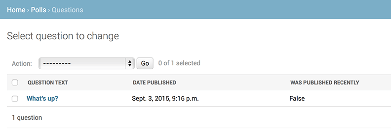

[Writing your first Django app, part 7](https://docs.djangoproject.com/en/1.11/intro/tutorial07/)

我们继续我们的Web-poll应用，我们将关注在定制由Django自动生成的admin站点。

# 1. 定制admin form

通过使用admin.site.register(Question)来注册Question对象，Django可以构造出一个默认的form表单。通常情况下，你想要定制admin form的外观和工作方式。你可以在注册对象时，同时告诉Django一些选项，来实现这个目的。

接下来，我们来实践一下，调整一下edit form中字段的顺序。使用以下内容替换admin.site.register(Question)：

    # polls/admin.py

    from django.contrib import admin
    from .models import Question

    class QuestionAdmin(admin.ModelAdmin):
    
        fields = ['pub_date', 'question_text']

    admin.site.register(Question, QuestionAdmin)

你可以参考这种模式 - 创建一个model admin类，然后把它作为admin.site.register()的第二个参数 - 如果你想要定制model的admin选项，你都可以这样实现。

刷新页面后，你就会发现变化，现在"Publication date"将会在"Question"前面被显示。

只有两个字段时，这没有什么值得称道的地方，但是如果admin form有很多字段时，选择一个合理的顺序是非常重要的。

说到有很多字段的form时，你可能想要把form划分成fieldset：

    # polls/admin.py

    from django.contrib import admin

    from .models import Question

    class QuestionAdmin(admin.ModelAdmin):

        fieldsets = [
            (None, {'fields' : ['question_text']}),
            ('Date information', {'fields' : ['pub_date']})
        ]

    admin.site.register(Question, QuestionAdmin)

在fieldsets中每个元组(tuple)的第一个元素是fieldset的标题。

# 2. 增加相关对象

好，我们完成了Question admin页面，但是每个问题有多个选项(Choice)，然后admin不显示这些选项。

有两种方式可以解决这个问题。第一种方案是像注册Question一样，我们也在admin中注册Choice。

这比较简单：

    # polls/admin.py
    
    from django.contrib import admin
    from .models import Choice, Question

    # ...
    admin.site.register(Choice)

现在Choices在Django admin中已经可以使用了。在这个form中，"Question"字段是一个下拉框，包含了数据库中每个问题。Django知道要将一个ForeignKey表示为admin中的一个<select\>框。当前情况中，只有存在一个问题。

同时也要注意"Question"后面的"Add Another"("+"号图标的链接)链接。所有有外链属性的字段，都会产生一个"Add Another"链接。当你点击"Add Another"，你会打开一个包含"Add question"表单的弹出窗口。如果你在这个窗口中添加一个问题，然后点击"保存"，Django将保存问题到数据库，并自动把他加载到"Add choice"表单的selected choice中。

移出Choice对象的register()调用。然后，Question注册代码：

    # polls/admin.py

    from django.contrib import admin
    from .models import Choice, Question

    class ChoiceInline(admin.StackedInline):
        model = Choice
        extra = 3

    class QuestionAdmin(admin.ModelAdmin):

        fieldsets = [
            (None, {'fields' : ['question_text']}),
            ('Date information', {'fields' : ['pub_date'], 'classes' : ['collapse']}),
        ]
        inlines = [ChoiceInline]

    admin.site.register(Question, QuestionAdmin)

这告诉Django："Choice对象应该在Question admin页面进行编辑。默认情况下，提供3个choice编辑项。"

他提供了这样的功能：这儿有三个相关的Choice插槽 - 数量由extra指定，对于已经存在Choice对象的情况，每次进入"Change"页面，你将得到另外三个插槽。

在三个插槽下面，有"Add another Choice"链接。如果你点击它，新的插槽将会被添加。如果想要移出加入的插槽，你可以点击新加入插槽右边的X号。

NOTE：你不能移出最初的三个插槽。

有一个小问题：它占用了大量空间来展示相关的Choice对象的属性。基于这个原因，Django提供了使用表格形式(扁平式)来显示内置的相关对象；你只需要修改ChoiceInline声明：

    # polls/admin.py

    class ChoiceInline(admin.TabularInline):

使用TabularInline(代替StackedInline)，相关对象被显示在一个更紧凑，基于表格的格式：

NOTE：这儿有一个扩展的"DELETE?"列，允许移出由"Add another Choice"添加的行或已存在的行。

# 3. 定制admin change list

现在Question admin页面看起来好多了，让我们对"change list"页面进行一些调整 - 显示系统中所有的问题。

以下就是我们要修改的页面：

默认情况下，Django显示每个对象的str()。但有时候，显示以单个字段进行显示可能更有帮助。为了实现这个，使用list_display admin选项，这是一个要显示属性名的元组，这些属性要作为列显示：

    # polls/admin.py

    class QuestionAdmin(admin.ModelAdmin):

        # ...
        list_display = ('question_text', 'pub_date')

为了更精准的显示，我们增加Tutorial 2中定义的was_published_recently()方法到显示列：

    # polls/admin.py

    class QuestionAdmin(admin.ModelAdmin):

        # ...
        list_display = ('question_text', 'pub_date', 'was_published_recently')

现在question change list页面看起来像这样：

你可以点击列头来进行排序，但是was_published_recently头，不支持排序。不支持对方法的输出结果进行排序。请注意was_published_recently的列头默认情况下是方法名(但是下划线会由空格替代)，每行包含了输出结果的string表示方式。

你可以通过给方法(polls/models.py)一些属性来改善上面提到的问题：

    # polls/models.py

    class Question(models.Model)

        # ...
        def was_published_recently(self):
            now = timezone.now()
            return now - datetime.timedelta(days=1) <= self.pub_date <= now
        was_published_recently.admin_order_field = 'pub_date'
        was_published_recently.boolean = True
        was_published_recently.short_description = "Published recently?"

[关于方法属性的更多资料，请查阅](https://docs.djangoproject.com/en/1.11/ref/contrib/admin/#django.contrib.admin.ModelAdmin.list_display)

再次编辑你的polls/admin.py文件，为Question change list页面增加一个改进：filters使用[list_filter](https://docs.djangoproject.com/en/1.11/ref/contrib/admin/#django.contrib.admin.ModelAdmin.list_filter)。把下加入到QuestionAdmin中：

    list_filter = ['pub_date']

增加"Filter"侧栏，可以让通过pub_date属性来过滤change list：

被显示的filter的类型依赖于需要过滤的字段类型。因为pub_date是[DatetimeField](https://docs.djangoproject.com/en/1.11/ref/models/fields/#django.db.models.DateTimeField)，Django知道给一个恰当的filter选项："Any date"，"Today"，"Past 7 days"，"This month"和"This year"。

非常好，让我们加一些搜索功能吧：

    search_fields = ['question_text']

这将在change list的顶部增加一他搜索框。当某人输入搜索条件，Django将搜索question_text字段。你可以使用添加很多类似的字段 - 由于它是使用LIKE查询，所以把搜索字段数量限制在一个合理范围将使数据库搜索更高效。

现在是时候为你的列表添加一个分页了。默认每页显示100条。[change list pagination](https://docs.djangoproject.com/en/1.11/ref/contrib/admin/#django.contrib.admin.ModelAdmin.list_per_page)、[search boxes](https://docs.djangoproject.com/en/1.11/ref/contrib/admin/#django.contrib.admin.ModelAdmin.search_fields)、[filters](https://docs.djangoproject.com/en/1.11/ref/contrib/admin/#django.contrib.admin.ModelAdmin.list_filter)、[date-hierarchies](https://docs.djangoproject.com/en/1.11/ref/contrib/admin/#django.contrib.admin.ModelAdmin.date_hierarchy)和[column-header-ordering](https://docs.djangoproject.com/en/1.11/ref/contrib/admin/#django.contrib.admin.ModelAdmin.list_display)。
所有的都是根据你认为它应该是怎么样工作，来实现的。

# 4. 定制admin外观(look and feel)

很明显，在每个admin页面顶部都有一个"Django administration"是很不顺眼的。但它仅仅是一个占位符。

这很容易修改，只需要使用Django模板系统。Django admin由Django自己驱动的，它的界面使用了Django自己的模板系统。

## 4.1 定制项目模板

在工程目录(包含manage.py的目录)中创建一个templates目录。模板可以存放文件系统的任何位置，只要Django可以访问到。(Django与用户的服务器运行在一起。)无论如何，将模板放在工程中是被推荐的方式。

    mkdir templates

打开你的设置文件(mysite/settings.py)，在TEMPLATES设置项中增加一个DIRS选项：

    # mysite/settings.py

    TEMPLATES = [

        {
            'BACKEND': 'django.template.backends.django.DjangoTemplates',
            'DIRS': [os.path.join(BASE_DIR, 'templates')],
            'APP_DIRS': True,
            'OPTIONS': {

                'context_processors': [
                    'django.template.context_processors.debug',
                    'django.template.context_processors.request',
                    'django.contrib.auth.context_processors.auth',
                    'django.contrib.messages.context_processors.messages',
                ],
            }
        }
    ]

DIRS是在加载Django模板时，要检查的文件目录；它是一个搜索路径。

> Organizing templates
> 
> 像静态文件一样，我们可以把模板放在一起，放入一个大的模板目录，它也会工作很好。无论如何，属于某个特定应用的模板，应该放在应用的模板目录(polls/templates)中而不是工程的目录(templates)中。我们将在[reusable apps tutorial](https://docs.djangoproject.com/en/1.11/intro/reusable-apps/)中更细致的讨论为什么我们要这样做。

现在在templates目录中创建admin目录，从默认的Django admin模板目录(django/contrib/admin/templates)中复制admin/base_site.html模板到templates/admin目录中。

> Where are the Django source files?
> 
> 可以通过以下命令，查找Django源代码文件位置：
> 
>     python3 -c "import django; print(django.__path__)"
>     
> 输出结果：
> 
>     ['/usr/local/lib/python3.5/dist-packages/django']

复制模板：

    cp /usr/local/lib/python3.5/dist-packages/django/contrib/admin/templates/admin/base_site.html templates/admin/

接下来，编辑该文件，用你自己站点的名字来替换{{ site_header|default:_('Django administration') }}。修改后的代码，应该如下：

    
    <h1 id="site-name"><a href="">Polls Administration</h1>
    

我们通过这个方式来教你怎么样重载模板。在实际的项目中，你可能会使用django.contrib.admin.AdminSite.site_header属性更容易的做这部分的定制化。

这个模板包含了许多像这样的内容：和{{ title }}。{%和{{是Django模板语言。当Django呈现admin/base_site.html时，这个模板语言将会被计算，产生最后的HTML页面，就像我们在Tutorial 3中所看到的一样。

NOTE：任何Django admin默认模板都可以被重载。为了重载模板，只需要做像对base_site.html做的操作一样 - 从默认目录复制模板到定制目录，修改期望修改的目录即可。

## 4.2 定制应用模板

聪明的读者想要问：DIRS默认是空的，Django是如何找到默认的admin目录的呢?答案是，由于APP_DIRS是被设置为True的，Django将自动的查找templates目录下的每个应用对应的模板子目录。(不要忘记djang.contrib.admin是一个应用。)

我们的poll应用不复杂并且不需要定制admin template。如果它变的更复杂并且为了某些功能需要修改Django标准admin模板，更明智的选择应该是修改应用模板，而不是项目模板。那样的话，你可以在任何新的工程中引入polls应用，并可以确保它会找到它需要的定制模板。

[template loading documentation](https://docs.djangoproject.com/en/1.11/topics/templates/#template-loading)

# 5. Customize the admin index page

同样，你可能想要定制admin主页。

默认它将按字母显示和admin应用一块被注册到INSTALLED_APPS中的应用。你可以想要对部局做出调整。毕竟，主页可能是最重要的页面，它应该更容易使用。

要定制的模板是admin/index.html。编辑这个文件时，你将看到它使用了一个模板变量：app_list。变量包含了每个安装的Django app。作为一种替代方案，你可以采用硬编码的方式来调整显示的app。

    cp -r /usr/local/lib/python3.5/dist-packages/django/contrib/admin/templates/admin/index.html templates/admin/

# 6. What's next?

初学者教程已经结束。同时，你可能想要看一下我们的一些指南：[where to go from here](https://docs.djangoproject.com/en/1.11/intro/whatsnext/)。

如果你熟悉Python packaging，感兴趣学习如何把polls转换成"reusable app"，请查阅[Advanced tutorial: How to write reusable apps](https://docs.djangoproject.com/en/1.11/intro/reusable-apps/)。

