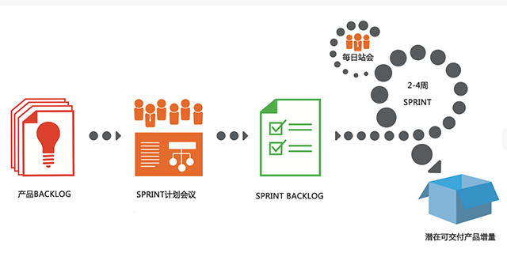
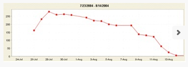

[http://www.scrumcn.com/agile/scrum-knowledge-library/scrum.html](http://www.scrumcn.com/agile/scrum-knowledge-library/scrum.html)

# 1. 什么是scrum

Scrum是一个用于开发和维持复杂产品的框架，是一个增量的、迭代的开发过程。

整个开发过程有若干个短的迭代周期组成，一个短的迭代周期称为一个Sprint(短跑)，每个Sprint的建议长度是2到4周(互联网产品研发可以使用1周的Sprint)。

特点：

* 在Scrum中，使用产品Backlog来管理产品的需求，
* 产品Backlog是一个按照商业价值排序的需求列表，列表条目的体现形式通常为用户故事。
* Scrum团队总是先开发对客户具有较高价值的需求。
* 在Sprint中，Scrum团队从产品Backlog中挑选最高优先级的需求进行开发。
* 挑选的需求在Sprint计划会议上经过讨论、分析和估算得到相应的任务列表，称为Sprint Backlog。
* 在每个迭代结束时，Scrum团队将递交潜在可交付的产品增量。

# 2. 角色

* 产品负责人
* Scrum Master
* Scrum团队

# 3. 成果提交

* 产品Backlog (Product Backlog)
* Sprint Backlog
* 产品增量(Increment)

# 4. 5个活动

* Sprint计划会议
* 每日站会
* Sprint评审会议
* Sprint回顾会议
* 产品Backlog梳理会议

# 5. 价值

* 承诺
* 专注
* 开放
* 尊重
* 勇气

# 6. 理论基础

* 透明性
* 检验
* 适应

# 7. 角色

## 7.1 产品负责人

管理产品待办事项列表的唯一责任人。

* 清晰的表达产品代办事项列表条目
* 对产品代办事项列表中的条目进行排序，最好地实现目标和使命
* 确保开发团队所执行工作的价值
* 确保产品代办事项列表对所有人可见、透明、清晰，并且显示Scrum团队的下一步工作
* 确保开发团队对产品代办事项列表中的条目达到一定程序的理解

## 7.2 开发团队

包含了专业人员，负责在每个Sprint的结尾交付潜在的可发布的"完成"产品增量。

* 他们是自组织的，没有人告诉开发团队如何把产品代办事项列表变成潜在可发布的功能。
* 开发团队是跨职能的，团队作为一个整体拥有创造产品增量所需要的全部技能。
* Scrum不认可开发团队成员的头衔，无论承担哪种工作他们都是开发者。此规则无一例外。
* 开发团队中的每个成员可以有特长和专注领域，但是责任归属于整个开发团队
* 开发团队不包含如测试或业务分析等负责特定领域的子团队

## 7.3 开发团队的规模

3 ~ 9人，不包括产品负责人和Scrum Master

## 7.4 Scrum Master

确保Scrum被理解并实施，Scrum Master是Scrum团队中的服务式领导。

### 7.4.1 Scrum Master服务于产品负责人

* 找到有效管理产品代办事项列表的技巧
* 清晰地和开发团队沟通愿景、目标和产品代表事项列表条目
* 教导开发团队创建清晰简明的产品代表事项列表条目
* 在经验主义环境中理解长期的产品规划
* 理解并实践敏捷
* 按需推动Scrum活动

### 7.4.2 Scrum Master服务于开发团队

* 指导开发团队自组织和跨职能
* 教导并领导开发团队创造高价值的产品
* 移除开发团队进展过程中的障碍
* 按需推动Scrum活动
* 在 Scrum 还未完全被采纳和理解的组织环境下指导开发团队

### 7.4.3 Scrum Master服务于组织

* 领导并指导组织采用 Scrum
* 在组织范围内计划 Scrum 的实施
* 帮助员工及干系人理解并实施 Scrum 和经验性产品开发
* 发起能提升Scrum 团队生产力的变革
* 与其他 Scrum Master 一起工作,帮助组织更有效的应用Scrum

# 8. Product Backlog

产品待办事项列表是一个排序的列表,包含所有产品需要的东西,也是产品需求变动的唯一来源。产品负责人负责产品待办事项列表的内容、可用性和优先级。

__产品待办事项列表是一个持续完善的清单, 最初的版本只列出最初始的和众所周知的需求。 产品待办事项列表根据产品和开发环境的变化而演进。待办事项列表是动态的,它经常发生变化以识别使产品合理、有竞争力和有用所必需的东西。__只要产品存在,产品待办事项列表就存在。

__产品待办事项列表列出了所有的特性、功能、需求、改进方法和缺陷修复等对未来发布产品进行的改变。产品待办事项列表条目包含描述、次序和估算的特征。__

__产品待办事项列表通常以价值、风险、优先级和必须性排序。它是一个按照优先级由高到低排列的一个序列，每个条目有唯一的顺序。__排在顶部的产品待办事项列表条目需要立即进行开发。排序越高,产品待办事项列表条目越紧急,就越需要仔细斟酌,并且对其价值的意见越一致。

__排序越高的产品待办事项列表条目比排序低的更清晰、更具体。根据更清晰的内容和更详尽的信息就能做出更准确的估算。优先级越低,细节信息越少。__开发团队在接下来的 Sprint 中将要进行开发的产品待办事项列表条目是细粒度的,已经被分解过,因此,任何一个条目在 Sprint 的时间盒内都可以被“完成”。开发团队在一个 Sprint 中可以“完 成”的产品待办事项列表条目被认为是“准备好的”或者“可执行的”,能在 Sprint 计划会议中被选择。

__通过产品Backlog地梳理来增添细节、估算和排序。这是一个持续不断 的过程,产品负责人和开发团队协作讨论产品代表事项列表条目的细节。在产品待办事项列表梳理的时候,条目会被评审和修改。然而, 产品负责人可以随时更新产品代办事项列表条目或酌情决定。__

__梳理在 Sprint 中是一项兼职活动,在产品负责人和开发团队之间展开。通常,开发 团队有自行优化的领域知识。然而,何时如何完成优化是 Scrum 团队的决定。优化通常占用不超过开发团队 10%的时间。__

# 9. 监控向目标前进的进度

在任何时间,达成目标的剩余工作量是可以被累计的。产品负责人至少在每个 Sprint 评审的时候追踪剩余工作总量。产品负责人把这个数量与之前 Sprint 评审时的剩余工作量做比较,来评估在希望的时间点完成预计工作达成目标的进度。这份信息对所有的干系人都透明。

Scrum 不考虑已经花在产品代办事项列表条目上的工作时间。我们只关心剩余工作和日期这两个变量。

各种趋势燃尽图、燃烧图和其他计划实践都能用来预测进度。

# 10. Sprint Backlog

Sprint 代办事项列表是一组为当前 Sprint 选出的产品代办事项列表条目,外加交付产品增量和实现 Sprint 目标的计划。Sprint 代办事项列表是开发团队对于哪些功能要包含在下个增量中,以及交付那些功能所需工作的预计。

Sprint 代办事项列表定义了开发团队把产品代办事项列表条目转换成“完成”的增量所需要执行的工作。Sprint 代办事项列表使开发团队确定的、达到 Sprint 目标所需的工 作清晰可见。

Sprint 代办事项列表是一份足够具体的计划,使得进度上的改变能在每日例会中得到理解。开发团队在整个 Sprint 中都会修改 Sprint 代办事项列表,Sprint 代办事项列表也会在 Sprint 的进程中慢慢显现,比如开发团队按照计划工作并对完成 Sprint 目标所需的工作有更多的了解。

__当出现新工作时,开发团队需要将其追加到 Sprint 待办事项列表中去。随着任务进行或者被完成,需要更新每项任务的估算剩余工作量。如果计划中某个部分失去开发的意义,就可以将其除去。在 Sprint 内只有开发团队可以对 Sprint 待办事项列表进行修改。__ Sprint 待办事项列表是高度可见的,是对团队计划在当前 Sprint 内完成工作的实时反映,并且该列表只属于开发团队。

Product Backlog 功能点被放到Sprint的固定周期中，Sprint Backlog 会因为如下原因发生变化:

* 随着时间的变化，开发团队对于需求有了更好的理解，有可能发现需要增加一些新的任务到Sprint Backlog中。

* 程序缺陷做为新的任务加进来，这个都做为承诺提交任务中未完成的工作。

Product Owner也许会和Scrum team一起工作，以帮助team更好的理解Sprint的目标，ScrumMaster和team也许会觉得小的调整不会影响sprint的进度，但会给客户带来更多商业价值。

## 10.1 监控Sprint进度

在 Sprint 中的任意时间点,Sprint 待办事项列表的所有剩余工作总和都可以被计算。开发团队至少在每日例会时追踪所有的剩余工作。开发团队每天追踪剩余总和并预测达成 Sprint 目标的可能性。通过在 Sprint 中不断追踪剩余工作,开发团队可以管理自己的进度。

Scrum 不考虑已经花在 Sprint 待办事项列表上的工作时间。我们只关心剩余工作和日期这两个变量。

# 11. 燃尽图

Sprint Burndown Chart 显示了Sprint中累积剩余的工作量，它是一个反映工作量完成状况的趋势图。 图中Y轴代表的是剩余工作量，X轴代表的是Sprint的工作日。

# 12. 用户故事

用户故事是从用户的角度来描述用户渴望得到的功能。一个好的用户故事包括三个要素：

* 角色：谁要使用这个功能。
* 活动：需要完成什么样的功能。
* 商业价值：为什么需要这个功能，这个功能带来什么样的价值。

用户故事通常按照如下的格式来表达：

作为一个<角色>, 我想要<活动>, 以便于<商业价值>

__举例：__

作为一个“网站管理员”，我想要“统计每天有多少人访问了我的网站”，以便于“我的赞助商了解我的网站会给他们带来什么收益。”

# 13. 模板

[敏捷项目管理模板](http://www.docin.com/p-117144267.html)

[agile project management excel templates](https://www.smartsheet.com/agile-project-management-excel-templates)