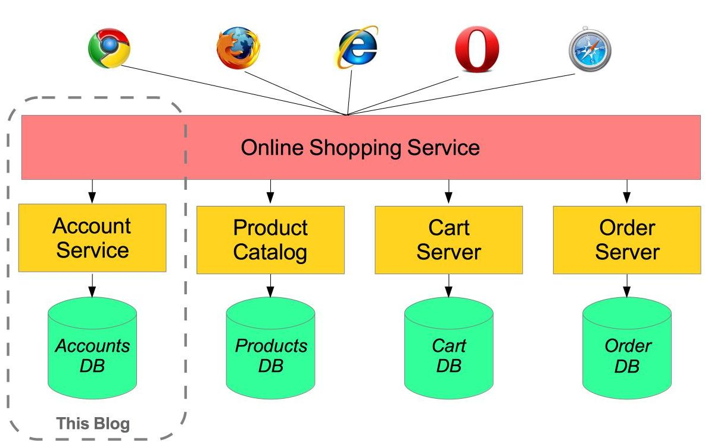

# 1. Spring Boot

## 1.1 为什么需要Spring Boot

* 可以快速体验Spring，并实现基于Spring快速开发
* 提供了大量默认配置；随着业务的增长，可以重载默认实现
* 提供了许多在大型项目中常用的非功能性的特性。如，嵌入式服务器，安全机制，相关指标测试，健康检查及扩展配置。
* 实现以上功能不需要生成额外代码和相关XML配置

## 1.2 如何使用Spring Boot

利用maven或gradle

### 1.2.1 继承方式

    <parent>
        <groupId>org.springframework.boot</groupId>
        <artifactId>spring-boot-starter-parent</artifactId>
        <version>2.0.0.BUILD-SNAPSHOT</version>
    </parent>

### 1.2.2 通过依赖管理方式

    <dependencyManagement>
         <dependencies>
            <dependency>
                <!-- Import dependency management from Spring Boot -->
                <groupId>org.springframework.boot</groupId>
                <artifactId>spring-boot-dependencies</artifactId>
                <version>2.0.0.BUILD-SNAPSHOT</version>
                <type>pom</type>
                <scope>import</scope>
            </dependency>
        </dependencies>
    </dependencyManagement>

## 1.3 加入类依赖

    <dependencies>
        <dependency>
            <groupId>org.springframework.boot</groupId>
            <artifactId>spring-boot-starter-web</artifactId>
        </dependency>
    </dependencies>

## 1.4 常用的starter

<table>
    <tr>
        <th>名称</th>
        <th>描述</th>
    </tr>
    <tr>
        <td>spring-boot-starter-web-services</td>
        <td>引入spring web services</td>
    </tr>
    <tr>
        <td>spring-boot-starter-mail</td>
        <td>引入Java Mail和spring框架中的邮件发送机制</td>
    </tr>
    <tr>
        <td>spring-boot-starter-data-redis</td>
        <td>引入spring data redis和Jedis客户端</td>
    </tr>
    <tr>
        <td>spring-boot-starter-web</td>
        <td>创建web应用或基于spring mvc的RESTful应用。默认使用Tomcat作为默认嵌入容器</td>
    </tr>
    <tr>
        <td>spring-boot-starter-data-jpa</td>
        <td>引入spring data jpa和hibernate</td>
    </tr>
</table>

### 1.4.1 专用的starters

* spring-boot-starter-undertow
* spring-boot-starter-jetty
* spring-boot-starter-tomcat

## 1.5 代码结构

### 1.5.1 不推荐使用默认包名

合法包名：

* com.spring.boot
* net.spring.boot
* org.spring.boot

### 1.5.2 spring boot入口类

推荐是放在项目顶级包中，例如，包名为org.spring.boot为项目顶级包，则放入该包中。

在包含main函数的类上添加@SpringBootApplication。

## 1.6 Spring自动配置

通过@EnableAutoConfiguration或@SpringBootApplication启用自动配置后，Spring将基于添加到类路径中的jar包，自动帮你进行配置。

__Note:__ 以DataSource为例，当用户自已定义DataSource后，默认的配置自动失效。

### 1.6.1 屏蔽特定的配置项

    @EnableAutoConfiguration(exclude={DataSourceAutoConfiguration.class})

## 1.7 杂项

### 1.7.1 依赖注入

* @ComponentScan
* @Component
* @Service
* @Repository
* @Controller
* @AutoWired
* __... ...__

### 1.7.2 如何运行Spring Boot项目

* java -jar
* mvn spring-boot:run (需要添加spring boot maven插件)
* gradle bootRun

### 1.7.3 开发工具

    <dependencies>
        <dependency>
            <groupId>org.springframework.boot</groupId>
            <artifactId>spring-boot-devtools</artifactId>
            <optional>true</optional>
        </dependency>
    </dependencies>

类路径中文件发生变化，将自动重启。对于静态资源和view模板不需要重启application。

可以借助JRebel来实现reload。

### 1.7.3 应用属性文件

在以下路径搜索application.properties

__Note:__ 以下提到的当前目录是指SpringApplication主入口类所在目录：

* 当前目录下的/config子目录
* 当前目录
* 类路径中的/config
* 类路径根目录

__Note:__ 列表中位于前面的属性文件，所定义的配置项优先级高于后面的文件中定义的配置项。

__\*\*\* 也可以使用YAML配置文件。__

### 1.7.4 YAML

    jdb:
        servers:
            - dev.bar.com
            - foo.bar.com
            
        candidateServers:
            - dev2.bar.com
            - foo2.bar.com
        
    ---
    
    spring:
        profiles: development
    
    jdb:
        servers:
            - dev.bar.com
            - foo.bar.com
        
        candidateServers:
            - dev2.bar.com
            - foo2.bar.com
        
    ---
        
    spring:
        profiles: production
    
    jdb:
        servers:
            - live.bar.com
            - foo.bar.com
            
        candidateServers:
            - live2.bar.com
            - foo2.bar.com

# 2. Spring Boot与Docker

[Spring Boot with Docker](https://spring.io/guides/gs/spring-boot-docker/)

## 2.1 什么是Docker

Docker是业界领先的软件容器平台。在多开发协作工作时，使用Docker可以消除"在我的电脑上可以工作呀"这样的问题。操作人员使用Docker在一个隔离的容器中并行的运行和管理apps。企业可以使用Docker来更快的，更安全，更自信的，在Linux和Windows服务器上发布新特性。

## 2.2 什么是容器

软件运行需要的全部内容被打包到一个隔离的容器中。不像虚拟机，容器不捆绑操作系统，仅包括可以让软件运行的依赖包和相关配置。这可以使它更高效，更轻量，自包含，并且可以保证不管软件被发布到什么环境，总是以相同方式运行。

## 2.3 docker镜像

在包含了dockerfile文件的代码库上工作是更简单的。依赖变成了一个打包的docker镜像，在docker和被安装的编辑器下建造和调试应用只需要几分钟就可以完成。

## 2.4 dockerfile

docker有一个简单的dockerfile文件来指定image中的"层"。在Spring Boot项目中创建dockerfile。

    FROM frolvlad/alpine-oraclejdk8:slim
    VOLUME /tmp
    ADD gs-spring-boot-docker-0.1.0.jar app.jar
    RUN sh -c 'touch /app.jar'
    ENV JAVA_OPTS=""
    ENTRYPOINT [ "sh", "-c", "java $JAVA_OPTS -Djava.security.egd=file:/dev/./urandom -jar /app.jar" ]

* VOLUME：spring为tomcat创建的默认工作目录

* RUN：你可以通过touch jar文件，使这个文件有修改时间(默认情况下，docker创建所有容器文件是以"unmodified"状态实现的)。但是对于静态内容来说，它将要求文件有个修改时间。

* 为了减少Tomcat startup time，我们添加了一个系统属性并指向了/dev/urandom

## 2.5 通过maven创建docker

    <properties>
       <docker.image.prefix>springio</docker.image.prefix>
    </properties>
    <build>
        <plugins>
            <plugin>
                <groupId>com.spotify</groupId>
                <artifactId>docker-maven-plugin</artifactId>
                <version>0.4.11</version>
                <configuration>
                    <imageName>${docker.image.prefix}/${project.artifactId}</imageName>
                    <dockerDirectory>src/main/docker</dockerDirectory>
                    <resources>
                        <resource>
                            <targetPath>/</targetPath>
                            <directory>${project.build.directory}</directory>
                            <include>${project.build.finalName}.jar</include>
                        </resource>
                    </resources>
                </configuration>
            </plugin>
        </plugins>
    </build>

## 2.6 发布docker到docker容器

    docker push

* AWS
* Microsoft Azure
* 阿里云

[Get Started with Docker](https://docs.docker.com/get-started/)

# 3. Spring Boot与Spring Cloud，以及微服务

[Microservices by Martin Flowler](https://martinfowler.com/articles/microservices.html)

Spring cloud基于spring boot之上，提供了大量的类库来增强应用的行为。你可以使用这些基本的默认行为实现快速开发，可以根据需要，通过配置或扩展来创建自己定制的解决方案。

Spring cloud关注在为通用的用户场景提供可实现的经验，以及为其它场景提供可扩展机制：

* 分布式/版本化配置
* 服务注册及发现
* 路由
* 服务间调用
* 负载均衡
* 断路器
* 全局锁
* 主服务选举机制和集群状态
* 分布式消息

Springe采用声明式方式，大多数情况只需要通过添加依赖或注释，就可以使用新功能。

## 3.1 微服务

微服务允许大的系统通过许多协同组件来建造。微服务是在进程级(process level)，但Spring一直做的是在组件级别(component level)：通过松耦合的进程替代松耦合的组件。

## 3.2 示例

[Microservices with Spring](https://spring.io/blog/2015/07/14/microservices-with-spring)